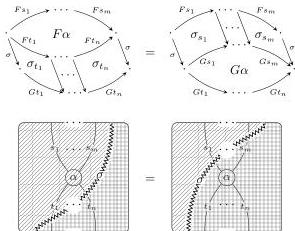
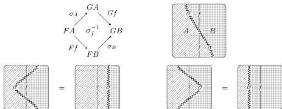
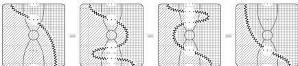

62

AARON DAVID FAIRBANKS AND MICHAEL SHULMAN

such that for each 2-cell $\alpha$ in $\mathbf{C}$, we have

A **lax transformation** is defined dually, with transformation component 1-cells at the northwest and southeast corners of diagrams (diagrams mirrored).

When the $\sigma_f$ 2-cells are all invertible, we call $\sigma$ simply a **transformation**.

*Remark A.6.* A transformation is both a colax transformation and a lax transformation: given a colax transformation where the $\sigma_f$ 2-cells are all invertible, the inverse 2-cells $\sigma_f^{-1}$ are components of a lax transformation, and vice versa.

Just as a transformation is a morphism of functors, a modification is a morphism of transformations. The most commonly seen definition of modification goes between two (lax or colax) transformations. However, there is a more general definition of modification that involves both *lax* and *colax* transformations. We actually get a (implicit) *double category* $\text{Hom}_{\text{co/lax}}(\mathbf{C}, \mathbf{D})$ where the horizontal arrows are lax transformations and the vertical arrows are colax transformations.