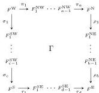
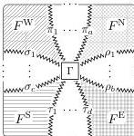
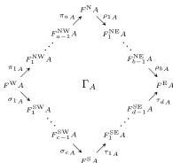
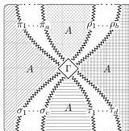
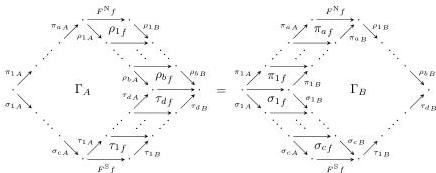

DOUBLY WEAK DOUBLE CATEGORIES

63

# Definition A.7. A modification

where $\pi_i$ and $\tau_i$ are lax transformations and $\rho_i$ and $\sigma_i$ are colax transformations of functors $\mathbf{C} \rightarrow \mathbf{D}$ consists of for each 0-cell $A$ in $\mathbf{C}$ a 2-cell $\Gamma_A$ in $\mathbf{D}$:

such that for any 1-cell $f: A \rightarrow B$ in $\mathbf{C}$, we have

