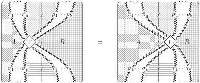

64

AARON DAVID FAIRBANKS AND MICHAEL SHULMAN

We define **horizontal compositions** and **vertical compositions** of modifications componentwise. Likewise **horizontal (lax) identity** and **vertical (colax) identity** modifications are identities componentwise.

**Proposition A.8.** *Functors, lax and colax transformations, and modifications between* $\mathbf{C}$ *and* $\mathbf{D}$ *form an implicit double category* $\mathrm{Hom}_{\mathbf{co}/\mathbf{lax}}(\mathbf{C}, \mathbf{D})$ *(via composition of modifications).*

*Proof.* The associativity, unit, and interchange laws are inherited from the 2-cells in $\mathbf{D}$. $\square$

We denote by $\mathrm{Hom}(\mathbf{C}, \mathbf{D})$ the implicit 2-category whose 0-cells are functors $\mathbf{C} \to \mathbf{D}$, 1-cells are *transformations*, and 2-cells are modifications between these.

*Remark A.9.* Given a colax transformation of implicit 2-category functors, if every component 1-cell is a left adjoint, we obtain (upon choosing adjunctions) a lax transformation in the other direction (where the new component 2-cells are the *mates* of the old ones). A *conjoint pair* in $\mathrm{Hom}_{\mathbf{co}/\mathbf{lax}}(\mathbf{C}, \mathbf{D})$ is such a pair of colax and lax transformations, with component 1-cells in left and right adjoint pairs.

On the other hand, as noted in **Remark A.6**, given a colax transformation, if every component 2-cell is invertible, we obtain a lax transformation in the same direction; this is the content of a (non lax or colax) transformation. A *companion pair* in $\mathrm{Hom}_{\mathbf{co}/\mathbf{lax}}(\mathbf{C}, \mathbf{D})$ is (up to isomorphism) such a transformation.

In general, implicit 2-categories may be identified with implicit double categories having horizontal and vertical 1-cells in assigned companion pairs. (It is the same as in the strict case; the translation from (implicit) 2-categories to such (implicit) double categories is the “squares” or “quintets” construction of **Example 3.6**.) The implicit 2-category $\mathrm{Hom}(\mathbf{C}, \mathbf{D})$ is then embedded in $\mathrm{Hom}_{\mathbf{co}/\mathbf{lax}}(\mathbf{C}, \mathbf{D})$ as the 1-cells with companions. (The former is recovered up to equivalence from the latter through the right adjoint to the quintets construction.)

It still remains to verify that $\mathrm{Hom}(\mathbf{C}, \mathbf{D})$ in fact provides an internal hom for the Gray tensor product. In other words, $\mathbf{C} \otimes \mathbf{D}$ is universal with a map $\mathbf{C} \to \mathrm{Hom}(\mathbf{D}, \mathbf{C} \otimes \mathbf{D})$:

**Proposition A.10.** **I-2-Cat** *is closed with respect to* $\otimes$.

*In particular, the Gray tensor product* $\mathbf{C} \otimes \mathbf{D}$ *is the free implicit 2-category on the following data and laws:*

- *For every 0-cell $c$ of* $\mathbf{C}$, *there is a functor* $(c, -): \mathbf{D} \to \mathbf{C} \otimes \mathbf{D}$.
- *For every 1-cell $f: c \to d$ of* $\mathbf{C}$, *there is a transformation* $(f, 1): (c, -) \to (d, -)$.