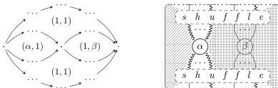

DOUBLY WEAK DOUBLE CATEGORIES

65

FIGURE 2. A generic 2-cell $(\alpha, \beta)$ in $\mathbf{C} \otimes \mathbf{D}$.

- For every 2-cell $\alpha$ of $\mathbf{C}$, there is a modification $(\alpha, 1)$ between the associated transformations.
- Such modifications compose as in $\mathbf{C}$, with identities as in $\mathbf{C}$.

Proof. Note first that the construction $\operatorname{Hom}(\mathbf{D}, \mathbf{X})$ is functorial in $\mathbf{X}$ (since functors, transformations, modifications, and their compositions are shapes consisting of cells and equations in $\mathbf{X}$), and a map from $\mathbf{C}$ into $\operatorname{Hom}(\mathbf{D}, \mathbf{X})$ is precisely the data in $\mathbf{X}$ as described above.

It is easy to see that $\mathbf{C} \otimes \mathbf{D}$ contains such data. Now suppose $\mathbf{X}$ also contains such data. We must check that the induced map on the putative generating cells extends to a unique functor $\mathbf{C} \otimes \mathbf{D} \to \mathbf{X}$.

All cells in $\mathbf{C} \otimes \mathbf{D}$ are indeed compositions of these generating cells: see Figure 2. Here each 2-cell written $(1, 1)$, or “shuffle”, may be composed in a canonical way (up to associativity) from the transformation component 2-cells $(f, d), (c', g) \to (c, g), (f, d')$ or their inverses, by constructing the induced permutation out of transpositions. We accordingly extend the map $\mathbf{C} \otimes \mathbf{D} \to \mathbf{X}$ to arbitrary cells, sending each 2-cell written as a composite of the generating 2-cells to the corresponding composite in $\mathbf{X}$.

To show functoriality, consider 2-cells in the image of this extended map $\mathbf{C} \otimes \mathbf{D} \to \mathbf{X}$, i.e. those built as in Figure 2. Vertical composites reduce to the desired form by transformation component 2-cells cancelling with their inverses; horizontal composites are put into the desired form using the naturality and modification laws.

It is then easy to see that the left adjoint acts as $-\otimes \mathbf{D}$ on morphisms as well.

Alternatively, we could skip this argument by appealing to existing knowledge about the Gray tensor product of 2-categories, of which the Gray tensor product of implicit 2-categories may be viewed as a special case; the Gray tensor product of strict 2-categories has a presentation like the above since its internal homs are given by 2-functors, pseudonatural transformations, and modifications of strict 2-categories. □

Remark A.11. Replacing the transformations in Proposition A.10 with (co)lax transformations, we obtain the (co)lax Gray tensor product [Gra74] as the presented structure. (The lax Gray tensor product is then the reverse of the colax Gray tensor product.) However, it is perhaps less obvious that this definition gives a (non-symmetric) monoidal product.