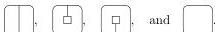
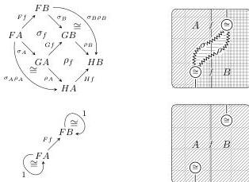

66

AARON DAVID FAIRBANKS AND MICHAEL SHULMAN

*Remark A.12.* In contrast, **I-2-Cat** is not cartesian closed. For example, let **C**, **D**₁, **D**₂ and **I** be respectively free on

Now the pushout of the unique functors **C** → **D**₁ and **C** → **D**₂ is not preserved by - × **I**. (Cartesian products in **I-2-Cat** are calculated using the essentially algebraic definition of implicit 2-categories in Section 5; note this does not agree with the cartesian product in **2-Cat**.) Indeed, this pushout has nontrivial composite 2-cells α with nullary source and target, so its product with **I** likewise has nontrivial 2-cells (α, 1). On the other hand **D**₁ and **D**₂ have no nontrivial 2-cells with nullary source and target, so the products with **I** are simply **I**, as is the pushout of these.

The next proposition implies in particular that if **C** and **D** are bicategories, then Hom$_{\text{co/lax}}$(**C**,**D**) is a doubly weak double category.

**Proposition A.13.** *If **C** and **D** are implicit 2-categories and **D** is represented, then Hom$_{\text{co/lax}}$(**C**,**D**) (and hence in particular Hom(**C**,**D**)) is represented.*

*Proof.* We define binary composites of colax transformations σ: F → G and ρ: G → H and identity transformations (nullary composites) componentwise on 1-cells, and with 2-cell components:

These are easily checked to be horizontal transformations. Moreover, the composition 2-cells in **D** are components of invertible modifications. Lax transformations are similar. □

*Remark A.14.* The Gray tensor product of two representable implicit 2-categories is usually *not* representable: if f: c → c' is an arrow in **C** and g: d → d' is an arrow in **D**, there is no composite 1-cell of the compatible (f, d) and (c', g) in **C** ⊗ **D**.

Next we observe that our notions of transformation, modification, and icon correspond to the usual notions for bicategories.

**Proposition A.15.** *Identifying represented implicit 2-categories and functors with bicategories and pseudofunctors (Proposition 2.9) respects (co)lax transformations, modifications, and icons, as well as their composition.*