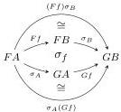
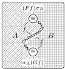
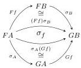
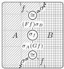
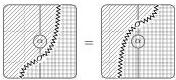

DOUBLY WEAK DOUBLE CATEGORIES

67

Proof. Suppose \(\sigma: F \to G\) is a colax transformation of implicit 2-category functors. We define a colax natural transformation of the underlying pseudofunctors as follows.

- The component 1-cell at 0-cell \(A\) is \(\sigma_A\).
- The component 2-cell at 1-cell \( f \colon A \to B \) is \( \sigma_f \) converted to a bigon:

The axioms of a colax natural transformation then follow from composition isomorphisms cancelling with their inverses and applications of the colax transformation naturality axiom.

Conversely, suppose  \( \sigma \)  is a colax natural transformation of pseudofunctors. We define a colax transformation of the underlying implicit 2-category functors as follows.

- The component 1-cell at 0-cell \(A\) is \(\sigma_A\).
- The component 2-cell is \(\sigma_f\) converted to a (2,2)-ary 2-cell:

When translated into a statement about corresponding cells in the underlying implicit 2-category, the naturality axiom yields

\[
\begin{array}{c} F f \xrightarrow {} F B \\ F a \xrightarrow {} F g \\ \sigma_ {A} \xrightarrow {} G a \end{array} = \begin{array}{c} F f \xrightarrow {} F B \\ F A \xrightarrow {} G f \\ \sigma_ {A} \xrightarrow {} G a \end{array}
\]

