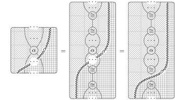
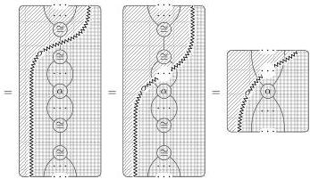
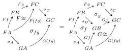
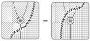
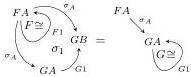
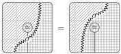

68

AARON DAVID FAIRBANKS AND MICHAEL SHULMAN

FIGURE 3. The colax transformation naturality axiom

for all bigons $\alpha$, and the coherence axioms yield

for all chosen composition isomorphisms. We obtain the implicit 2-category colax transformation naturality axiom for an arbitrary 2-cell $\alpha$ by bracketing up its 1-cells and moving $\sigma$ across the resulting bigon, as shown in Figure 3. These translation