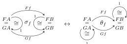
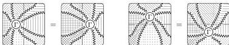

DOUBLY WEAK DOUBLE CATEGORIES

69

processes are clearly inverse. Moreover, it is easy to see that identities, compositions, and whiskerings are sent to identities, compositions, and whiskerings, as defined in e.g. [JY21].

Our general notion of modification between lax and colax transformations of implicit 2-categories corresponds to a notion for bicategories defined in the same way, and it is easy to see that the specialization to modifications between only lax or only colax transformations (and their composition) coincides with the usual definition, as in e.g. [JY21].

Finally, icons in a represented implicit 2-category are in one-to-one correspondence with colax transformations whose components are identities, by composing the naturality 2-cells with nullary composition isomorphisms:

Composition and whiskering for icons are also as in [Lac08].

*Remark A.16.* It is easy to generalize most of the results of this section to double-categorical versions, with a few caveats. We refer the reader to [Böh19] for definitions of horizontal and vertical pseudonatural transformations, modifications, and Gray tensor products of strict double categories; see also [Mor23] for definitions of horizontal and vertical lax and colax transformations.

A maximally general definition of modification between both lax and colax horizontal and vertical transformations of (implicit) double categories can be formulated by placing transformation component 1-cells at all possible corners of the diagram:

One then expects to assemble some two-dimensional categorical structure, analogous to $\text{Hom}_{\text{co/lax}}(\mathbf{C}, \mathbf{D})$, in which 0-cells are functors, 1-cells are lax and colax transformations, and 2-cells are these generalized modifications. But here there are four different sorts of 1-cells, apparently requiring an analogue of a (implicit) double category with octagon-shaped rather than square 2-cells.

*Remark A.17.* There is a relationship between double categories and (co)lax transformations of 2-categories. Let $H\mathbf{C}$ denote the vertically trivial (implicit) double category with horizontal (implicit) 2-category $\mathbf{C}$, let $V\mathbf{D}$ denote the horizontally trivial (implicit) double category with vertical (implicit) 2-category $\mathbf{D}$, and let $Q\mathbf{X}$ denote the (implicit) double category of “quintets” of (implicit) 2-category $\mathbf{X}$.

By comparing presentations, we can see that a (implicit) 2-category functor from the *lax* Gray tensor product (Remark A.11) of $\mathbf{C}$ and $\mathbf{D}$ into $\mathbf{X}$ is the same as a (implicit) double category functor $H\mathbf{C} \otimes V\mathbf{D} \rightarrow Q\mathbf{X}$. (Here the double-categorical Gray tensor product $H\mathbf{C} \otimes V\mathbf{D}$ simply agrees with the cartesian product of strict double categories, due to lack of nontrivial 1-cells of each type in some factor. This