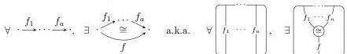

DOUBLY WEAK DOUBLE CATEGORIES

9

**Definition 2.1.** An **implicit 2-category** is a strict 2-category whose category of 1-cells is free (i.e. freely generated by a directed graph).

We call the generating 1-cells simply **1-cells**, and we do not use this word for their compositions, which we rather call **paths of 1-cells**. The arrows and strings in our pasting diagrams and string diagrams always refer to generating 1-cells, and we draw these arrows with a distinguished arrowhead $\longrightarrow$. We call a 2-cell whose source and target are both length 1 paths a **bigon**.

A **functor** of implicit 2-categories is a strict 2-functor *that sends 1-cells to 1-cells*. We write **I-2-Cat** for the category of implicit 2-categories and such functors.

For clarity, we may call the strict 2-category associated to an implicit 2-category its **path 2-category**. (1-cells in the path 2-category are paths of 1-cells in the implicit 2-category.)

When a path of 1-cells is isomorphic to a single 1-cell, we call the latter a **composite** of the path. We call an implicit 2-category **representable** if each path of 1-cells has a composite.

**Remark 2.2.** An implicit 2-category with one 0-cell and one 1-cell is known elsewhere as a **PRO**; an implicit 2-category with one 0-cell (which we might call an “implicit monoidal category”) is often called a **colored PRO**.

The result to be shown, that bicategories are equivalent to representable implicit 2-categories, specializes to that monoidal categories are equivalent to representable colored PROs.

**Definition 2.3.** An implicit 2-category is **represented** if it has a *chosen* isomorphism between each length 2 or 0 path of 1-cells and a composite 1-cell.

It follows that every path of 1-cells has a composite (i.e. represented implies representable). We denote the chosen composite of 1-cells $f: A \rightarrow B$ and $g: B \rightarrow C$ by $fg: A \rightarrow C$ and we denote the chosen nullary composite at the 0-cell $A$ by $1_A: A \rightarrow A$. A functor between represented implicit 2-categories is called **strict** if it preserves the chosen composition isomorphisms.

**Remark 2.4.** One could alternatively suppose a chosen composition isomorphism for *every* path of 1-cells, instead of just binary and nullary paths. This would be equivalent to an *unbiased* bicategory.

To translate from bicategories to represented implicit 2-categories is the construction known as *strictification*. (Strictification of bicategories is typically described as a functor **W-2-Cat** $\rightarrow$ **2-Cat**, but it may be described slightly more precisely as a functor **W-2-Cat** $\rightarrow$ **I-2-Cat**.) For proof that this indeed defines a functor, we refer to e.g. [Gur13, Chapter 2];$^{6}$ showing this from the definitions below amounts to a series of straightforward verifications.

By a *bracketing* of a path of 1-cells in a bicategory, we mean a single 1-cell produced from the path by composing and introducing units. For example, a path

$^{6}$The definition of strictification in [Gur13] makes choices of parenthesizations whereas we use “cliques” of parenthesizations following [nLa25]; this makes no essential difference but we find the presentation with cliques helpful.