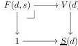

It comes with an obvious map to $\underline{S}$, which was defined as $\underline{S}(d) = \coprod_{s \in S(d)} 1$. This functor has a right adjoint $\mathcal{E}^D \downarrow \underline{S} \to \mathcal{E}^{D \downarrow S}$ sending a functor $V: D \to \mathcal{E}$ with a natural transformation $V \to \underline{S}$ to the functor $F: D \downarrow S \to \mathcal{E}$ where $F(d, s)$ is defined as the following pullback:

These two adjoints functor are equivalences. Indeed, the counit of this adjunction is an isomorphism by universality of coproducts and the unit is an isomorphism by effectivity of coproducts. $\square$

We now turn our attention to the class of complemented inclusions. These will be useful for construction of certain colimits whose existence is not immediately obvious in lextensive categories and, especially, in their diagram categories. First of all, recall that a morphism $i: A \to B$ in $\mathcal{E}$ is a *complemented inclusion* if it has a *complement*, i.e., a morphism $j: C \to B$ such that $i$ and $j$ exhibit $B$ as a coproduct of $A$ and $C$ in $\mathcal{E}$. In other words, $i$ is isomorphic to the coproduct inclusion $A \to A \sqcup C$. We will often say simply that $C$ is a complement of $A$. The notation $A \rightsquigarrow B$ will be sometimes used to indicate complemented inclusions. Note that complemented inclusions are sometimes (e.g., in our previous work [GSS19, Hen19]) called *decidable inclusions* in reference to the notion of decidability in constructive logic.

#### Lemma 2.9.

- (i) *If $\mathcal{E}$ is lextensive, then the pushout of a complemented inclusion along any morphism exists and is again a complemented inclusion. Moreover, such pushouts are preserved by functors (and pseudo-functors) that preserve finite coproducts and thus are van Kampen colimits.*
- (ii) *If $\mathcal{E}$ is countably lextensive, then the colimit of a sequence of complemented inclusions exists and is again a complemented inclusion. Moreover, such colimits are preserved by functors (and pseudo-functors) that preserve countable coproducts and thus are van Kampen colimits.*

*Proof.* If $i: A \to B$ is a complemented inclusion with complement $C$, then the pushout of $i$ along $A \to D$ is $C \sqcup D$. Similarly, if $i_k: A_k \to A_{k+1}$ are complemented inclusions with complements $C_{k+1}$, then $\operatorname{colim}_k A_k$ is $\coprod_k C_k$ (where $C_0 = A_0$). The claims on preservation by functors then follow immediately.

These presentations of colimits as coproducts remain when we consider $\mathcal{E}$ as a bicategory. Recall from Lemma 2.2 that a colimit is van Kampen exactly if it is preserved by a certain pseudo-functor. Since (finite or countable) coproducts are assumed van Kampen, so are the presented colimits. $\square$

#### Lemma 2.10. Assume $\mathcal{E}$ is lextensive.

- (i) *complemented subobjects in $\mathcal{E}$ are closed under finite unions.*
- (ii) *complemented inclusions in $\mathcal{E}$ are closed under finite limits, i.e., if $X \to Y$ is a natural transformation between finite diagrams in $\mathcal{E}$ that is a levelwise complemented inclusion, then so is the induced morphism $\lim X \to \lim Y$.*

*Proof.* The proof of [GSS19, Lemma 1.1.4] applies verbatim. $\square$

12