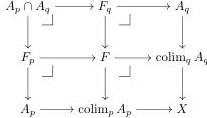

**Lemma 2.14.** *Let $\mathcal{C}$ be a category, $P$ a poset with binary meets, $X \in \mathcal{C}$ an object and*

$$A = (A_p \hookrightarrow X \mid p \in P)$$

*a diagram of subobjects of $X$ closed under intersection, i.e., such that $A_p \cap A_q = A_{p \cap q}$. Then if $A$ has a van Kampen colimit, the colimit is also a subobject of $X$.*

*Proof.* We assume that $\operatorname{colim}_{p \in P} A_p$ exists and is a van Kampen colimit, and we show that the diagonal map $\operatorname{colim}_{p \in P} A_p \rightarrow F = (\operatorname{colim}_{p \in P} A_p) \times_X (\operatorname{colim}_{p \in P} A_p)$ is an isomorphism. First, we form pullbacks:

Using that the colimits are van Kampen, we have that $F = \operatorname{colim}_p F_p$ and $F_p = \operatorname{colim}_q A_q \cap A_p$ and hence $F = \operatorname{colim}_{p,q} A_p \cap A_q$ with the two maps $F \rightarrow \operatorname{colim}_p A_p$ being induced by the maps $A_p \cap A_q \rightarrow A_p$ and $A_p \cap A_q \rightarrow A_q$. We conclude by observing that $\operatorname{colim}_p (A_p \cap A_q) = A_q$. Indeed the map $P \rightarrow (\downarrow q)$ that send $p \in P$ to $p \cap q$ is right adjoint to the inclusion of $(\downarrow q)$ to $P$, so it is a final functor. It hence follows that

$$\operatorname{colim}_{p \in P} A_{p \cap q} = \operatorname{colim}_{p \in q} A_p = A_q$$

So this implies that $F = \operatorname{colim}_q A_q$, with the projection map $F \rightarrow \operatorname{colim}_q A_q$ being the identity, hence proving that $\operatorname{colim}_q A_q \rightarrow X$ is a monomorphism. $\square$

We prove a statement relating van Kampen colimits and the pullback evaluation $\widehat{\operatorname{ev}}$ functor, defined in (1.5). This statement will be needed in Section 8.

**Lemma 2.15.** *Let $D$ be a small category. Let $Y: C \rightarrow [D^{\operatorname{op}}, \mathcal{E}]$ be a diagram with levelwise van Kampen colimit $\operatorname{colim} Y$. Let $p: X \rightarrow Y$ be a Cartesian transformation, which we regard as a $C$-indexed diagram of arrows in $[D^{\operatorname{op}}, \mathcal{E}]$.*

*Let $q: A \rightarrow B$ be a map in $[D^{\operatorname{op}}, \operatorname{Set}]$ with $B$ representable such that $[D^{\operatorname{op}}, \mathcal{E}]$ supports evaluation at $A$. Then $\widehat{\operatorname{ev}}_q$ (valued in arrows of $\mathcal{E}$) preserves the colimit of $p$, the resulting colimit is computed separately on source and target, and all maps of the colimit cocone are pullback squares.*

*Proof.* First note that by levelwise effectivity of $\operatorname{colim} Y$, we obtain $\operatorname{colim} X$ (and hence $\operatorname{colim} p$). The square $p_c \rightarrow \operatorname{colim} p$ is a pullback for all $c \in C$.

Consider the functor $F$ sending an arrow $M \rightarrow N$ in $[D^{\operatorname{op}}, \mathcal{E}]$ to the sequence of arrows

$$M(B) \longrightarrow M(A) \times_{N(A)} N(B) \longrightarrow N(B).$$

The first arrow is the pullback evaluation at $q$ of $M \rightarrow N$. Evaluation preserves limits, in particular pullbacks. By pullback pasting, the action of $F$ on a map of arrows that is a pullback is a pasting of pullback squares.

14