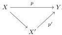
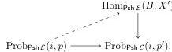

**Definition 3.7.** Let $i: A \to B$ and $p: X \to Y$ be morphisms of $\mathcal{E}^D$. Assume that we have a factorisation

We say that $p$ satisfies the $X'$-partial enriched right lifting property with respect to $i$ if there is a lift in the diagram

Such partial lifting properties are a crucial ingredient of the small object argument, but they are only tractable when $i$ is a levelwise complemented inclusion. This is thanks to the next two lemmas, where we use the tensor defined in (3.1).

**Lemma 3.8.** *Levelwise complemented inclusions in $\mathcal{E}^D$ are closed under:*

- (i) $E \times -$ for all $E \in \mathcal{E}$;
- (ii) *countable coproducts*;
- (iii) *pushouts along arbitrary morphisms*;
- (iv) *sequential colimits*;
- (v) *retracts*.

*Moreover, the colimits of parts (ii), (iii) and (iv) are preserved by $E \times -$ for all $E \in \mathcal{E}$.*

*Proof.* The functor $E \times -$ and all the colimits mentioned are computed levelwise in $\mathcal{E}$, so the results boil down to the fact that complemented inclusions in $\mathcal{E}$ are stable under all these constructions. Stability under $E \times -$ follows from distributivity of product over coproduct in complemented categories: if $A \to A \sqcup B$ is a complemented inclusion, then its image under $E \times -$ is $E \times A \to (E \times A) \sqcup (E \times B)$ and is a complemented inclusion. The case of a countable coproduct is also clear: if $A_k \to A_k \sqcup B_k$ is a family of complemented inclusions, then their coproduct can be written as $\coprod A_k \to (\coprod A_k) \sqcup (\coprod B_k)$. Stability under pushout and sequential composition follows from Lemma 2.9. The fact that they are preserved by $E \times -$ follows from Lemma 2.9. The case of retracts can be deduced from the stability under limits proved in Lemma 2.10 as retracts can be seen as limits. $\square$

**Lemma 3.9.** *Let $p: X \to Y$ be a map in $\mathcal{E}^D$ and $\mathcal{L}$ a class of levelwise complemented inclusions in $\mathcal{E}^D$ that have the enriched left lifting property with respect to $p$. Then $\mathcal{L}$ is closed under the following operations:*

- (i) *tensors by objects of $\mathcal{E}$*,
- (ii) *countable coproducts*,

18