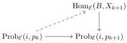
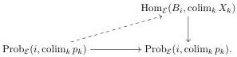
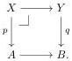

Proof. Fix a morphism $i: A \to B$ of $I$. Since $A$ and $B$ are finite, the given partial enriched lifting properties are $\mathcal{E}$-enriched. Moreover, since $X_k \to X_{k+1}$ is a levelwise complemented inclusion, Lemma 2.10 implies that $\mathrm{Prob}_{\mathcal{E}}(i, p_k) \to \mathrm{Prob}_{\mathcal{E}}(i, p_{k+1})$ is a complemented inclusion.

Proceeding by induction with respect to $k$, we can pick lifts

that are natural in $k$. Indeed, since $\mathrm{Prob}_{\mathcal{E}}(i, p_{k-1}) \to \mathrm{Prob}_{\mathcal{E}}(i, p_k)$ is a complemented inclusion, we can construct a compatible lift by assembling a previously constructed lift on $\mathrm{Prob}_{\mathcal{E}}(i, p_{k-1})$ with a given lift on its complement. Since $A$ and $B$ are finite, we have

$$\underset{k}{\operatorname{colim}} \operatorname{Hom}_{\mathcal{E}}(B, X_k) = \operatorname{Hom}_{\mathcal{E}}(B, \underset{k}{\operatorname{colim}} X_k)$$

and

$$\begin{aligned} \underset{k}{\operatorname{colim}} \operatorname{Prob}_{\mathcal{E}}(i, p_k) &= \underset{k}{\operatorname{colim}} \left( \operatorname{Hom}_{\mathcal{E}}(A, X_k) \times_{\operatorname{Hom}_{\mathcal{E}}(A, Y)} \operatorname{Hom}_{\mathcal{E}}(B, Y) \right) \\ &= \left( \underset{k}{\operatorname{colim}} \operatorname{Hom}_{\mathcal{E}}(A, X_k) \right) \times_{\operatorname{Hom}_{\mathcal{E}}(A, Y)} \operatorname{Hom}_{\mathcal{E}}(B, Y) \\ &= \operatorname{Hom}_{\mathcal{E}}(A, \underset{k}{\operatorname{colim}} X_k) \times_{\operatorname{Hom}_{\mathcal{E}}(A, Y)} \operatorname{Hom}_{\mathcal{E}}(B, Y) \\ &= \operatorname{Prob}_{\mathcal{E}}(i, \underset{k}{\operatorname{colim}} p_k), \end{aligned}$$

the latter by universality of sequential colimits of complemented inclusions in $\mathcal{E}$ (Lemma 2.9). Thus we obtain a diagram

where the bottom map is an identity, i.e., these lifts form a section that exhibits $\operatorname{colim}_k X_k \to Y$ as an $I$-fibration.

The following lemma isolates a simpler version of the inductive step in the construction of lifts in Lemma 3.12. It is needed in Section 8.

Lemma 3.13. Let

20