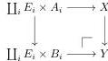
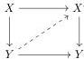

We conclude this section by introducing the notion of a cell complex and establish a few results that will be useful later.

**Definition 3.16.** For a family of maps $I = (i: A_i \to B_i \mid i \in I)$, an $\mathcal{E}$-enriched $I$-cell complex is a morphism of $\mathcal{E}^D$ that is a sequential colimit of maps $X \to Y$ arising as pushouts

for some family $(E_i)_{i \in I}$ of objects of $E$.

Below, we simply speak of an $I$-cell complex for brevity.

**Proposition 3.17.** *Under the hypotheses of Theorem 3.14, a morphism of $\mathcal{E}^D$ is an $I$-cofibration if and only if it is a codomain retract of an $I$-cell complex. In particular, every $I$-cofibration is a levelwise complemented inclusion.*

*Proof.* A retract of an $I$-cell complex is an $I$-cofibration by Lemma 3.9. It is furthermore a levelwise complemented inclusion by Lemma 3.8. Conversely, let $X \to Y$ be an $I$-cofibration and consider the factorisation $X \to X' \to Y$ defined in the proof of Theorem 3.14. Then $X \to X'$ is an $I$-cell complex by construction. Moreover, $X \to Y$ has the $\text{Psh } \mathcal{E}$-enriched left lifting property with respect to $X' \to Y$ and, in particular, it has the ordinary left lifting property (by evaluating the hom-presheaves at the terminal object). Thus there is a lift in the diagram

which exhibits $X \to Y$ as a codomain retract of $X \to X'$.

**Lemma 3.18.** *In the setting of Theorem 3.14, the following hold.*

- (i) *Consider a countable family of maps $f_k$ in the arrow category of $\mathcal{E}^D$. If $f_k$ is an $I$-fibration for all $k$, then so is the coproduct $\coprod_k f$. When $\mathcal{E}$ is $\alpha$-lextensive, the same holds for $\alpha$-coproducts.*
- (ii) *Consider a span $f_0 \leftarrow f_{01} \rightarrow f_1$ in the arrow category of $\mathcal{E}^D$. Assume that both legs form pullback squares and that $f_{01} \rightarrow f_0$ is a levelwise complemented inclusion on codomains. If $f_k$ is an $I$-fibration for $k = 0, 1, 01$, then so is the pushout colim $f$.*
- (iii) *Consider a sequential diagram $f_0 \rightarrow f_1 \rightarrow \dots$ in the arrow category of $\mathcal{E}^D$. Assume that the maps $f_k \rightarrow f_{k+1}$ form pullback squares and are levelwise complemented inclusions on codomains. If $f_k$ is an $I$-fibration for all $i$, then so is colim $f$.*

22