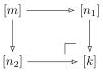
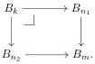

have an absolute pushout

in $\Delta$ with $[n_1] \to [k]$ and $[n_2] \to [k]$ degeneracy operators. Note that $[m] \to [k]$ is distinct from the identity. By absoluteness, we obtain a pullback

We now work in subobjects of $B_m$. From the above pullback, we have $B_k = B_{n_1} \cap B_{n_2}$. Using from Lemma 2.9 twice that pushouts along complemented inclusions are stable under pullback, we compute

$$
\begin{array}{l}
(A_m \cup B_{n_1}) \cap (A_m \cup B_{n_2}) = ((A_m \cup B_{n_1}) \cap A_m) \cup ((A_m \cup B_{n_1}) \cap B_{n_2}) \\
\quad = A_m \cup ((A_m \cup B_{n_1}) \cap B_{n_2}) \\
\quad = A_m \cup (B_{n_1} \cap B_{n_2}) \\
\quad = A_m \cup B_k.
\end{array}
$$

We obtain, in subobjects of $B_m$, that $F$ at $[m] \to [n]$ is the intersection (computed as pullback) of $F$ at $[m] \to [n_1]$ and $[m] \to [n_2]$. Thus, in subobjects of $B_m$, the diagram $F$ (and then also $F_\star$) preserves binary meets. Recollecting from above that the colimit of $F_\star$ in the slice over $B_m$ is van Kampen, Lemma 2.14 shows that it is subterminal.

## 5 Closure properties of cofibrations

This section is devoted to further study of weak factorisation systems constructed in Section 4, in preparation for the proof of the existence of the effective model structure. We begin with a simple verification.

**Lemma 5.1.** *If $A \to B$ is a (trivial) cofibration between levelwise countable simplicial sets, then $\underline{A} \to \underline{B}$ is a (trivial) cofibration in $\mathfrak{sE}$.*

*Proof.* Recall that the partial functor $X \mapsto \underline{X}$ is a partial left adjoint to the levelwise global sections functor. This is equivalently the functor $\operatorname{Hom}_{\mathfrak{sSet}}(1, -)$ with $1 \in \mathfrak{sE}$ from Section 1. By adjointness using the weak factorisation systems of Theorem 4.2 and Proposition 4.1, it suffices to show that $\operatorname{Hom}_{\mathfrak{sSet}}(1, -)$ preserves (trivial) fibrations. This holds by Proposition 1.4.

# Proposition 5.2.

(i) Trivial fibrations are fibrations.
(ii) Trivial cofibrations are cofibrations.

29