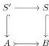
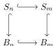
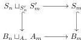

## Lemma 5.6.

- (i) *Let $E \in \mathcal{E}$. The constant simplicial object $E \in \mathfrak{s}\mathcal{E}$ is cofibrant.*
- (ii) *The domains and codomains of all morphisms of $I_{\mathfrak{s}\mathcal{E}}$ and $J_{\mathfrak{s}\mathcal{E}}$ are cofibrant.*
- (iii) *Let $X \in \mathfrak{s}\mathcal{E}$ and $K$ be a finite simplicial set. If $X$ is cofibrant, then so is $K \pitchfork X$.*

*Proof.* For part (i), by Lemma 3.9, the tensor of $\partial\Delta[0] \rightarrow \Delta[0]$ with $E$ is a cofibration. By Lemma 5.4, this map is the tensor of $E \in \mathfrak{s}\mathcal{E}$ with $\partial\Delta[0] \rightarrow \Delta[0]$, i.e., the map $\varnothing \rightarrow E$ in $\mathfrak{s}\mathcal{E}$. Part (ii) holds since $S \mapsto S$ preserves cofibrations by Lemma 5.1.$^{5}$ Finally, for part (iii), if $[m] \rightarrow [n]$ is a degeneracy operator, then the map $(K \pitchfork X)_n \rightarrow (K \pitchfork X)_m$ can be identified with the map $X(K \times \Delta[n]) \rightarrow X(K \times \Delta[m])$. It follows from [Hen19, Proposition 3.1.11] that when $K$ is a finite simplicial set, the map $K \times \Delta[n] \rightarrow K \times \Delta[m]$ is a finite composite of pushouts of degeneracy operators. This implies that the map $(K \pitchfork X)_n \rightarrow (K \pitchfork X)_m$ is a finite composite of pullbacks of degeneracy operator $X_a \rightarrow X_b$. As $X$ is cofibrant these maps are all complemented inclusions, hence as complemented inclusions are closed under pullback and composition, this implies that $(K \pitchfork X)_n \rightarrow (K \pitchfork X)_m$ is a complemented inclusion as well. $\square$

## Lemma 5.7. *Cofibrations are closed under pullback along a monomorphism.*

*Proof.* Consider a pullback square of simplicial objects:

We check that $S' \rightarrow S$ is a cofibration using characterisation (ii) of Theorem 4.6. In an lextensive category, a pullback of a complemented inclusion is a complemented inclusion, hence the map $S' \rightarrow S'$ is a levelwise complemented inclusion. Given any degeneracy operator $[m] \rightarrow [n]$, as it is a split epimorphism and $S \rightarrow B$ is a monomorphism, the naturality square:

is a pullback. The pushout $B_m \sqcup_{A_m} A_n$ is a van Kampen colimit because the map $A_m \rightarrow B_m$ is a complemented inclusion, it hence follows that we have a pullback square:

$^{5}$Constructively, for part (ii) one needs to check also that the relevant objects are cofibrant in $\mathfrak{s}\mathfrak{S}\mathfrak{e}$. The simplices and their boundaries are cofibrant in $\mathfrak{s}\mathfrak{S}\mathfrak{e}$ by [GSS19, Lemma 1.3.5] and the horns by [GSS19, Lemma 1.4.9].

31