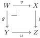
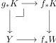

(i) the pullback functor $f^* : \mathcal{E} \downarrow Y \rightarrow \mathcal{E} \downarrow X$ has a right adjoint $f_* : \mathcal{E} \downarrow X \rightarrow \mathcal{E} \downarrow Y$,

(ii) $X$ is exponentiable as an object of $\mathcal{E} \downarrow Y$.

*Proof.* This follows from [Joh02, Lemma A1.5.2 (i)] and (the proof of) [Joh02, Corollary A1.5.3]. $\square$

When the equivalent conditions of Proposition 6.1 hold, we say that $f$ is *exponentiable* and refer to the right adjoint $f_*$ as the *pushforward along $f$*. (It is also known as the *dependent product along $f$*.)

**Example 6.2.** Let $S$ be a finite set. Then, $\underline{S} \in \mathcal{E}$ defined in (2.2) is exponentiable in $\mathcal{E}$ and the exponential of $X$ by $\underline{S}$ is the product $X^S$. Indeed, as finite coproducts in $\mathcal{E}$ are universal, $\underline{S} \times X \cong \prod_{s \in S} X$. Hence, a map $\underline{S} \times A \rightarrow X$ is the same as an $S$-indexed collection of maps $A \rightarrow X$, that is the same as a map $A \rightarrow X^S$.

**Proposition 6.3.** *Let*

be a pullback square in $\mathcal{E}$. If $f$ is exponentiable, then so is $g$ and the canonical natural transformation $u^* f_* \rightarrow g_* v^*$ is an isomorphism.

*Proof.* This follows from [Joh02, Lemma A1.5.2 (ii)] applied in the slice category over $Z$. If $K$ is an object over $W$, the pushforward $g_* K$ is constructed explicitly as the pullback:

where the bottom arrow is the unit of adjunction $Y \rightarrow f_* f^* Y = f_* W$. $\square$

**Proposition 6.4.** *Let $D$ be a small category and $f_*: X_* \rightarrow Y_*$ a natural transformation between two $D$-diagrams in $\mathcal{E}$ such that $f_*$ is Cartesian, $f_d$ is exponentiable for every $d \in D$, and $Y_*$ has a van Kampen colimit in $\mathcal{E}$. Then the colimit map*

$$f : \begin{array}{c} \operatorname{colim} \atop d \in D \end{array} X_d \rightarrow \begin{array}{c} \operatorname{colim} \atop d \in D \end{array} Y_d$$

*is exponentiable, and up to the equivalences*

$$\mathcal{E} \downarrow \operatorname{colim} \atop D X_d \simeq \lim \atop D (\mathcal{E} \downarrow X_d), \qquad \mathcal{E} \downarrow \operatorname{colim} \atop D Y_d \simeq \lim \atop D (\mathcal{E} \downarrow Y_d),$$

*the functor $f_*$ coincides with the collection of functors $(f_d)_*$.*

33