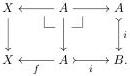

Proof. The claim follows from a general fact. If $F: \mathcal{A} \to \mathcal{B}$ is a pseudo-natural transformation between two diagrams $\mathcal{A}, \mathcal{B}: D \to \mathsf{Cat}$ of categories such that each $F_d$ has a right adjoint $R_d$ and for each naturality square of $F_d$ the Beck–Chevalley conditions are satisfied, then the isomorphisms given by the Beck–Chevalley condition exhibit $R_d: \mathcal{B}_d \to \mathcal{A}_d$ as a pseudo-natural transformation, and $\lim R_d$ is a right adjoint to $\lim F_d$, with the unit and counit of this adjunction being levelwise the unit and counit of the adjunction $F_d \dashv R_d$.

We now move on to discuss how exponentiability interacts with cofibrancy. In particular, the aim of the rest of the section is to prove the following result.

**Theorem 6.5.** Let $i: A \to B$ be a cofibration between cofibrant object in $\mathfrak{sE}$. Then:

(i) $i$ is exponentiable,
(ii) $i_*$ sends cofibrant objects to cofibrant objects.

We will prove this theorem by a saturation argument. For this purpose, we introduce now the class $\mathcal{G}$ of cofibrations between cofibrant objects that satisfy properties (i) and (ii) of the theorem.

Assume $i: A \to B$ an exponentiable monomorphism in $\mathcal{E}$. Then, for any $X \in \mathcal{E} \downarrow A$, the unit of the adjunction $i^* \dashv i_*$ induces a pullback square

$$\begin{array}{c} X \longrightarrow i_* X \\ \downarrow \quad \downarrow \\ A \xrightarrow[i]{} B. \end{array} \tag{6.1}$$

Indeed, since $i$ is a monomorphism, the counit $i^* i_! \to \mathrm{id}$ of the adjunction $i_! \dashv i^*$ is invertible, and therefore so is the unit $\mathrm{id} \to i^* i_*$.

**Lemma 6.6.** Let $i: A \to B$ be a map in $\mathcal{G}$. For cofibrant $X \in \mathcal{E} \downarrow A$, the map $X \to i_* X$ is a cofibration.

Proof. The claim follows from part (i) of Proposition 5.9, since the map $X \to i_* X$ is a pullback of a cofibration between cofibrant objects by (6.1) above.

**Proposition 6.7.** The class $\mathcal{G}$ is closed under pushouts along maps with cofibrant target.

Proof. If $i: A \to B$ is in $\mathcal{G}$ and $f: A \to X$ is an arbitrary arrow in $\mathfrak{sE}$ with $X$ cofibrant, we consider the diagram

Then the two squares are pullbacks (because $i$ is a monomorphism for the one on the right) the vertical maps are all exponentiable by assumption, so by Proposition 6.4, the map between the colimit of the first row to the colimit of the second row, that is the map

$$j: X \to X \sqcup_A B,$$

34