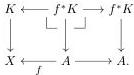
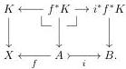
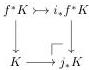
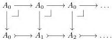
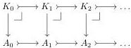

is indeed exponentiable. Moreover, still by Proposition 6.4, if $K$ is a cofibrant object over $X$, it corresponds with respect to the van Kampen pushout of the first row to the Cartesian natural transformation

Hence its image by $j_*$ corresponds to the Cartesian natural transformation

So, by gluing along the bottom van Kampen colimit, we have a pushout square

where the top arrow is a cofibration by Lemma 6.6 and the assumption that $i \in \mathcal{G}$ applied to the cofibrant object $f^*K$. It follows that $j_*K$ is cofibrant. $\square$

**Proposition 6.8.** *The class $\mathcal{G}$ is closed under sequential composition.*

*Proof.* The class $\mathcal{G}$ is clearly closed under finite composition. Given an $\omega$-chain $A_0 \xrightarrow{i_0} A_1 \xrightarrow{i_1} A_2 \xrightarrow{i_2} \dots$ of arrows in $\mathcal{G}$, we consider the diagram:

Each vertical map is in $\mathcal{G}$ as a composite of maps in $\mathcal{G}$; each square is a pullback as all these maps are monomorphisms, so by Proposition 6.4, the comparison map $j: A_0 \to \operatorname{colim} A_i$ between the two colimit is exponentiable. If $K$ is a cofibrant object over $A_0$, then again by Proposition 6.4 its image by $j_*$ corresponds to the Cartesian natural transformation:

35