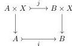
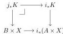

where $K_0 = K$ and $K_{n+1} = (i_n)_*K_n$, hence all the maps in the top row are cofibrations, and so $j_*K = \text{colim } K_i$ is cofibrant. $\square$

**Proposition 6.9.** *The class $\mathcal{G}$ is closed under tensors by objects of $\mathcal{E}$.*

*Proof.* Let $i: A \mapsto B$ an arrow in $\mathcal{G}$, and let $X$ an object of $\mathcal{E}$. The square

is a pullback, so $j$ is exponentiable by Proposition 6.3. Moreover, the formula for $j_*$ given in the proof of Proposition 6.3 gives that $K$ over $A \times X$ we have a pullback square

Since $i \in \mathcal{G}$ and $B \times X$ is cofibrant, $i_*K$ is cofibrant, and so $j_*K$ is cofibrant, as required. $\square$

In order to conclude the proof of Theorem 6.5, it remains to show that the generating cofibrations $i: \partial\Delta[n] \mapsto \Delta[n]$ are in $\mathcal{G}$. This is based on an explicit description of $i_*$ using the characterisation of $\mathfrak{s}\mathcal{E} \downarrow \partial\Delta[n]$ and $\mathfrak{s}\mathcal{E} \downarrow \Delta[n]$ of Lemma 2.8.

**Proposition 6.10.** *The generating cofibrations $i: \partial\Delta[n] \mapsto \Delta[n]$ are in $\mathcal{G}$.*

*Proof.* Under the equivalence of Lemma 2.8, the pullback functor $i^*: \mathfrak{s}\mathcal{E} \downarrow \Delta[n] \to \mathfrak{s}\mathcal{E} \downarrow \partial\Delta[n]$ coincides with the functor

$$\mathfrak{s}\mathcal{E}^{\Delta^{\text{op}} \downarrow \Delta[n]} \to \mathfrak{s}\mathcal{E}^{\Delta^{\text{op}} \downarrow \partial\Delta[n]}$$

obtained by reindexing along the sieve inclusion: $\Delta^{\text{op}} \downarrow \partial\Delta[n] \to \Delta^{\text{op}} \downarrow \Delta[n]$, hence its right adjoint, if it exists, is the right Kan extension along this sieve inclusion. So if we prove that the pointwise right Kan extension along this sieve inclusion exists, it will coincide with $i_*$. If $\mathcal{F} \in \mathfrak{s}\mathcal{E} \downarrow \partial\Delta[n]$, then this pointwise right Kan extension evaluated at $\Delta[k] \to \Delta[n] \in \Delta \downarrow \Delta[n]$ is given by the limit

$$(i_*\mathcal{F})([k]) = \lim_{p \in P} \mathcal{F}(p), \quad \text{where } P = \left\{ \begin{array}{c} \Delta[a] \longrightarrow \Delta[k] \\ \searrow_p \searrow \downarrow \\ \Delta[n], \end{array} \right. \quad p \text{ not surjective} \right\}.$$

This is a limit over an infinite category so it is not guaranteed to exists, but the category $P$ has a finite reflective category given by the objects such that the map $\Delta[a] \to \Delta[k]$ is injective, with the reflection given by the image factorisation of this map, and hence this limit coincides with

$$(i_*\mathcal{F})([k]) = \lim_{p \in P^+} \mathcal{F}(p), \quad \text{where } P^+ = \left\{ \begin{array}{c} \Delta[a] \longmapsto \Delta[k] \\ \searrow_p \searrow \downarrow \\ \Delta[n], \end{array} \right. \quad p \text{ not surjective} \right\},$$

36