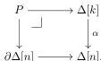
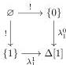

which is a finite limit, hence exists, which proves the existence of $i_*$.

Next, we assume that $\mathcal{F}$ is cofibrant, and we will show that $i_*\mathcal{F}$ is cofibrant. That is, given a degeneracy $[k] \rightarrow [k']$ the action $i_*\mathcal{F}([k']) \rightarrow i_*\mathcal{F}([k])$ is a complemented inclusion (by Theorem 4.6). The map $i_*\mathcal{F}([k]) \rightarrow \Delta[n] ([k])$ gives a decomposition of the map above into a coproduct indexed by all the map $\alpha: [k] \rightarrow [n]$, so it is enough to show that the fiber above each such map is a complemented inclusion. The fiber over such a map $\alpha$ of $i_*\mathcal{F}([k])$, is by definition of $i_*$ the object classifying maps $P \rightarrow \mathcal{F}$ over $\partial\Delta[n]$ where $P$ is the pullback square

The fiber of $i_*\mathcal{F}([k'])$ over $\alpha$ is described similarly with $P'$ the pullback of $\Delta[k'] \rightarrow \Delta[n]$, and the map we are interested in is induced by the map $P' \rightarrow P$ obtained as the pullback of $\Delta[k'] \rightarrow \Delta[k]$. But it follows from [Hen19, Proposition 3.1.11] that a pullback of a degeneracy operator is an iterated pushout of degeneracy operators, in this case a finite such iterated pushout as $P'$ is finite. As $\mathcal{F}$ is cofibrant, this decomposes $\mathcal{F}(P) \rightarrow \mathcal{F}(P')$ as a composite of complemented inclusions, and hence concludes the proof. $\square$

*Proof of Theorem 6.5.* We show that all cofibrations with cofibrant domain are in $\mathcal{G}$. By Lemma 4.4, it suffices to show that the generating cofibrations are in $\mathcal{G}$ and that $\mathcal{G}$ is closed under operations appearing in a cell complex. The case of generators is Proposition 6.10. Closure under tensoring by objects of $\mathcal{E}$ is Proposition 6.9, closure under pushout (along maps with cofibrant target) is Proposition 6.7, and closure under sequential composition is Proposition 6.8. $\square$

An analysis of the proof of Theorem 6.5 shows that the assumption that $A$ is cofibrant is not needed for the exponentiability of $i$, as it is only used for the part of the argument regarding preservation of cofibrant objects by $i_*$.

## 7 The Frobenius property

We adapt the notion of a strong homotopy equivalence and the associated concepts from [GS17, Section 3] to our setting. Recall that a map $f: A \rightarrow B$ is a 0-oriented (respectively, *1-oriented*) homotopy equivalence if there is a map $g: B \rightarrow A$ with homotopies $u: gf \sim \text{id}_A$ and $v: fg \sim \text{id}_B$ (respectively, $u: \text{id}_A \sim gf$ and $v: \text{id}_B \sim fg$). Such a homotopy equivalence is called *strong* if the homotopies satisfy the coherence condition $fu = vf$.

We recall the abstract characterisation of strong homotopy equivalences. The commuting square

induces maps $\theta_0: ! \rightarrow \lambda_1^0$ and $\theta_1: ! \rightarrow \lambda_1^1$ in the arrow category of sSet. (We will use $\lambda_k^i$ to denote the horn inclusion $\Lambda^i[k] \rightarrow \Delta[k]$.) Note that $!$ is the unit of the pushout tensor and pullback cotensor of

37