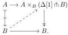
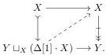
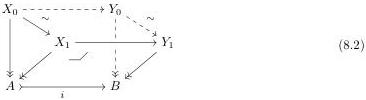

Proof. For part (i), in $\mathcal{E} \downarrow X$, given a trivial cofibration $A \to B$, we take a lift

Here, the right map is a composition of the pullback cotensor with $\partial\Delta[1] \to \Delta[1]$ of $B \to 1$ and a pullback of $A \to 1$, hence a fibration by parts (i) and (ii) of Lemma 1.5. The lift exhibits $A \to B$ as a strong deformation retract, in particular a homotopy equivalence.

For part (ii), given a fibration $X \to Y$ in $\mathcal{E}_{\mathrm{cof}}$, we take a lift

Here, the left map is a composition of a pushout of $\varnothing \to Y$ and the pushout tensor with $\partial\Delta[1] \to \Delta[1]$ of $\varnothing \to X$, hence a cofibration by Lemma 3.9 and Proposition 5.5. The lift exhibits $X \to Y$ as the dual of a strong deformation retract, in particular a homotopy equivalence over $Y$.

**Proposition 8.2.** Let $X \in \mathfrak{s}\mathcal{E}_{\mathrm{cof}}$. The fibration category structure on $\mathfrak{s}\mathcal{E} \downarrow X$ of Theorem 1.9 restricts to $\mathfrak{s}\mathcal{E}_{\mathrm{cof}} \downarrow X$. Path objects are given by cotensor with $\Delta[1]$. The weak equivalences coincide with homotopy equivalences over $X$.

Proof. By part (iii) of Proposition 5.9, $\mathfrak{s}\mathcal{E}_{\mathrm{cof}} \downarrow X$ has finite limits and they are computed as in $\mathfrak{s}\mathcal{E} \downarrow X$. By part (iii) of Lemma 5.6, cotensor with $\Delta[1]$ over $X$ preserves cofibrant objects. Thus, all aspects of the fibration category $\mathfrak{s}\mathcal{E} \downarrow X$ of Theorem 1.9 restrict to cofibrant objects. This includes path objects, which are given by cotensor with $\Delta[1]$.

It remains to show that pointwise weak equivalences in $\mathfrak{s}\mathcal{E}_{\mathrm{cof}} \downarrow X$ coincide with homotopy equivalences over $X$. Every homotopy equivalence is a pointwise weak equivalence by Proposition 1.10. For the reverse direction, we use the mapping path space factorisation in $\mathfrak{s}\mathcal{E}_{\mathrm{cof}} \downarrow X$, which has a homotopy equivalence over $X$ as first factor and fibration as second factor. Since pointwise weak equivalences and homotopy equivalences over $X$ satisfy the 2-out-of-3 property, it suffices to show that every pointwise weak equivalence that is a fibration (hence a trivial fibration) is a homotopy equivalence over $X$. This is part (ii) of Proposition 8.1.

**Proposition 8.3** (Equivalence extension property). In $\mathfrak{s}\mathcal{E}_{\mathrm{cof}}$, consider the solid part of the diagram

40