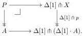

where the lower square is a pullback and $X_0 \to X_1$ is a homotopy equivalence over $A$. Then there is $Y_0$ as indicated such that the back square is a pullback and $Y_0 \to Y_1$ is a homotopy equivalence over $B$.

Proof. The proof of [GSS19, Proposition 3.2.1] applies, but played out in $\mathfrak{sE}_{\mathrm{cof}}$ instead of $\mathfrak{sSet}_{\mathrm{cof}}$. We limit ourselves to listing the key claims used in the proof and why they hold in our setting.

- The slice categories $\mathfrak{sE}_{\mathrm{cof}} \downarrow A$ and $\mathfrak{sE}_{\mathrm{cof}} \downarrow B$ admit fibration category structures, established in Proposition 8.2, in which weak equivalences are given by fiberwise homotopy equivalences.
- The dependent product functor $i_*$ along $i$ exists and preserves cofibrant objects, as shown in Theorem 6.5.
- The functor $i_*$ preserves trivial fibrations, which follows by adjointness since $i^*$ preserves cofibrations, as stated in part (i) of Proposition 5.9.
- In the slice over $B$, pullback cotensor with a cofibration preserves trivial fibrations, which holds by Lemma 1.8.

In $\mathfrak{sE}_{\mathrm{cof}}$, we say that a (trivial) fibration $X \twoheadrightarrow A$ extends along a map $A \to B$ if there is a pullback square

$$\begin{array}{c} X \dashrightarrow Y \\ \downarrow \quad \downarrow \\ A \longrightarrow B \end{array} \tag{8.3}$$

with the extension $Y \to B$ of $X \to A$ again a (trivial) fibration. If $A \to B$ has this property for all (trivial) fibrations $X \twoheadrightarrow A$, we say that it has the (trivial) fibration extension property.

Lemma 8.4. Let $f$ and $g$ be composable maps in $\mathfrak{sE}_{\mathrm{cof}}$. If $g \circ f$ has the (trivial) fibration extension property, then so does $f$.

Proof. We extend along $f$ by extending along $g \circ f$ and pulling back along $g$ (using part (ii) of Lemma 1.5 and part (ii) of Proposition 5.9).

Proposition 8.5 (Trivial fibration extension property). Cofibrations in $\mathfrak{sE}$ have the trivial fibration extension property.

Proof. This is the special case of Proposition 8.3 where $X_1 \to A$ and $Y_1 \to B$ are the identities on $A$ and $B$, respectively. We use Theorem 1.9 and Proposition 4.1 to go between trivial fibrations and fibrations that are weak equivalences.

Lemma 8.6. Let $p \colon X \twoheadrightarrow \Delta[1] \cdot A$ be fibration in $\mathfrak{sE}$ with $A$ and $X$ cofibrant. Then there is a homotopy equivalence between $X|_{\{0\} \cdot A}$ and $X|_{\{1\} \cdot A}$ over $A$.

Proof. Take the pullback

41