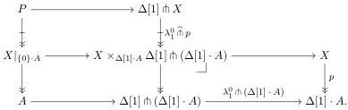
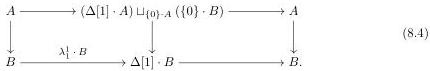
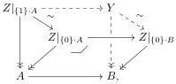

Here, the bottom map is the unit of the tensor-cotensor adjunction. The right map is a fibration by part (i) of Lemma 1.5, hence the left map is a fibration by part (ii) of Lemma 1.5. The top right object is cofibrant is cofibrant by part (i) of Lemma 1.5 and part (ii), hence the top left object is cofibrant by part (ii).

We will argue that there are trivial fibrations from $P$ to $X|_{\{0\} \cdot A}$ and $X|_{\{1\} \cdot A}$ over $A$. These trivial fibrations are homotopy equivalences over $A$ by part (ii) of Proposition 8.1. Inverting and composing them as needed gives the desired weak equivalence.

We only construct the trivial fibration from $P$ to $X|_{\{0\} \cdot A}$ (the other case is dual). Consider the diagram

The two composite squares and the bottom right square are pullbacks by construction. Pullback pasting induces the top left map and makes the top left square a pullback. The top middle map is a trivial fibration by part (i) of Lemma 1.5, hence so is the top left map by part (ii) of Lemma 1.5. $\square$

Our aim now is to prove the fibration extension property for trivial cofibrations in $\mathfrak{s}\mathcal{E}_{\mathrm{cof}}$. For this purpose, we introduce the class $\mathcal{H}$ of cofibrations in $\mathfrak{s}\mathcal{E}_{\mathrm{cof}}$ that have the fibration extension property.

**Lemma 8.7.** *The class $\mathcal{H}$ contains cofibrations in $\mathfrak{s}\mathcal{E}_{\mathrm{cof}}$ that are strong homotopy equivalences.*

*Proof.* Let $A \to B$ be a cofibration in $\mathfrak{s}\mathcal{E}_{\mathrm{cof}}$ and 0-oriented strong homotopy equivalence (the 1-oriented case is dual). We will solve the extension problem (8.3). By the characterisation of strong homotopy equivalences given by part (3) of Lemma 7.1, we have a retract diagram

Let $Z \to \Delta[1] \cdot A \sqcup_{\{0\} \cdot A} \{0\} \cdot B$ denote the pullback of $X \to A$ along the top right map. Pulling back $Z$ to $\Delta[1] \cdot A$, $\{0\} \cdot A$ and $\{0\} \cdot B$ (the components of its base pushout), we obtain the solid part of the diagram

42