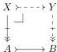
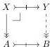
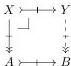

(i) Let $A \rightarrow B$ be a cofibration and $X \rightarrow A$ be a trivial fibration. There is a pullback square

with $X \rightarrow Y$ a cofibration and $Y \rightarrow B$ a trivial fibration.

(ii) Let $A \rightarrow B$ be a trivial cofibration and $X \rightarrow A$ be a fibration. There is a pullback square

with $X \rightarrow Y$ a trivial cofibration and $Y \rightarrow B$ a fibration.

(iii) Let $A \rightarrow B$ be a trivial cofibration and $X \rightarrow A$ be a trivial fibration. There is a pullback square

with $X \rightarrow Y$ a trivial cofibration and $Y \rightarrow B$ a trivial fibration.

*Proof.* Part (i) is the combination of Proposition 8.5 with part (i) of Proposition 5.9. Part (ii) is the combination of Proposition 8.13 with Proposition 7.6. Part (iii) follows from part (i) using Proposition 7.6 (with Proposition 5.2). $\square$

Recall from Section 1 that a map $X \rightarrow Y$ in $\mathfrak{s}\mathcal{E}_{\text{fib}}$ is a weak equivalence in the fibration category of Theorem 1.7 if and only if it is a pointwise weak equivalence in the sense of Definition 1.6, i.e., $\operatorname{Hom}_{\mathfrak{s}\text{Set}}(E, X) \rightarrow \operatorname{Hom}_{\mathfrak{s}\text{Set}}(E, Y)$ is a weak homotopy equivalence of simplicial sets for all $E \in \mathcal{E}$. Restricting to cofibrant objects, we obtain a notion of weak equivalence in $\mathfrak{s}\mathcal{E}_{\text{cof, fib}}$ that satisfies 2-out-of-3 and interacts as expected with cofibrations and fibrations, as recollected below.

**Lemma 9.2.** In $\mathfrak{s}\mathcal{E}_{\text{cof, fib}}$, we have:

- (i) a cofibration is a trivial cofibration exactly if it is a weak equivalence,
- (ii) a fibration is a trivial fibration exactly if it is a weak equivalence.

*Proof.* Part (ii) is a corollary of Proposition 4.1. For part (i), the forward direction is the combination of part (i) of Proposition 8.1 and Proposition 1.10. With this, the reverse direction follows by the retract argument. $\square$

45