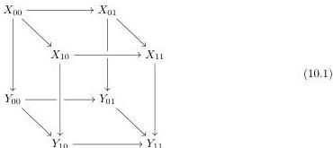

## 10 Descent and right properness

Having established the existence of the effective model structure on $\mathfrak{s}\mathcal{E}$, we now study some of its properties and those of its associated $\infty$-category $\mathrm{Ho}_{\infty}(\mathfrak{s}\mathcal{E})$. There are many (essentially equivalent) ways of associating an $\infty$-category to a model category, and our result will make little use of a concrete details of how it is done beyond some very general results. For the sake of completeness, when we say $\infty$-category we mean quasicategory, and for a general category $\mathcal{C}$ equipped with a class of weak equivalences, we define $\mathrm{Ho}_{\infty}(\mathcal{C})$ as the $\infty$-category obtained by universally inverting the weak equivalences in $\mathcal{C}$. We refer to [Cis20], especially its Chapter 7, for the general theory of such localisations.

We begin by studying the behaviour of colimits, using the notion of descent, which was introduced in model categories by Rezk [Rez10] as a part of development of higher topos theory. We show that $\mathfrak{s}\mathcal{E}$ and hence $\mathrm{Ho}_{\infty}(\mathfrak{s}\mathcal{E})$ satisfies *descent* whenever $\mathfrak{s}\mathcal{E}$ is countably extensive. This means that colimits in $\mathrm{Ho}_{\infty}(\mathfrak{s}\mathcal{E})$ satisfy the higher categorical version of the van Kampen property. In the case of pushouts, this is spelled out in Proposition 10.1 below. As in the ordinary categorical case, a colimit in an $\infty$-category $\mathcal{C}$ satisfies descent if and only if it is preserved by the functor from $\mathcal{C}^{\mathrm{op}}$ to the $\infty$-category of $\infty$-category classified by the slice cartesian fibration. This is essentially proved in section 6.1.3 of [Lur09], see for example 6.1.3.9.

**Proposition 10.1** (Model structure descent for pushouts). *Let $\mathcal{E}$ be a countably extensive category and let*

*be a cube in $\mathfrak{s}\mathcal{E}$. Assume that the bottom face is a homotopy pushout and that the left and back faces are homotopy pullbacks. Then the following are equivalent:*

- (i) *The top face is a homotopy pushout,*
- (ii) *the right and front faces are homotopy pullbacks.*

*Proof.* Let us view $[1]$ as a Reedy category consisting only of face operators. We consider the Reedy model structure $[D^{\mathrm{op}}, \mathfrak{s}\mathcal{E}]$ of $\mathfrak{s}\mathcal{E}$ over the Reedy category $D = [1] \times ([1] \times [1])^{\mathrm{op}}$. The significance of taking opposites on the latter two factors is that the Reedy category structure is inverted; the face operators become degeneracy operators. Recall from the beginning of Section 9 that we regard only certain (co)limits to be part of a model structure; the theory of Reedy model structures makes sense in this setting as seen in Section 4 for the case of the Reedy weak factorisation system over $\Delta$.

The given cube (10.1) forms an object of this category by sending $(0, a, b)$ to $Y_{ab}$ and $(1, a, b)$ to $X_{ab}$. Recall that weak equivalences in the Reedy model structure are levelwise and homotopy

49