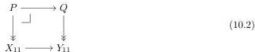
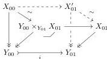
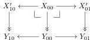

pushouts and pullbacks are invariant under levelwise weak equivalences. We replace the given cube by a cofibrant and fibrant object. This reduces the claim to the case of (10.1) where all object are cofibrant and fibrant, all horizontal maps are cofibrations, and all vertical maps are fibrations.

Let us check the direction from (i) to (ii), i.e., universality. Take the pullback of the bottom face along $X_{11} \rightarrow Y_{11}$. Since all vertical faces in (10.1) are homotopy pullbacks, we obtain a square weakly equivalent to the top face. This reduces the claim to the situation where in addition all vertical faces in (10.1) are pullbacks. Note that the cofibrancy assumptions are preserved by part (i) of Proposition 5.9.

Denote $Q$ the pushout in the bottom face. Since $Y_{00} \rightarrow Y_{01}$ is a levelwise complemented inclusion (Proposition 3.17), $P$ is a van Kampen pushout by Lemma 2.9, in particular stable under pullback. From universality, we obtain a pullback square

where $P$ is the pushout in the top face. Since $X_{00} \rightarrow X_{01}$ and $Y_{00} \rightarrow Y_{01}$ are cofibrations, the bottom and top faces are homotopy pushouts exactly if the maps $P \rightarrow X_{11}$ and $Q \rightarrow Y_{11}$ are weak equivalences, respectively. The goal thus follows from right properness applied to (10.2).

Let us check the direction from (ii) to (i), i.e., effectivity. Take the pushout in the horizontal faces. Since all horizontal maps are cofibrations and the horizontal faces are homotopy pushouts, we obtain a cube weakly equivalent to the given cube. This reduces the goal to the situation where all horizontal faces in (10.1) are pushouts, but note that we lose fibrancy properties involving $X_{11}$ and $Y_{11}$. The cube is now determined (up to isomorphism) by just the left and back faces. Weakly equivalent left and back faces give rise to weakly equivalent cubes.

Since the back face is a homotopy pullback and the vertical maps are fibrations, the map $X_{00} \rightarrow Y_{00} \times Y_{01} X_{01}$ is a weak equivalence. We apply the equivalence extension property of Proposition 8.3 to this situation:

We perform the same construction in the left face, obtaining $X'_{10}$. Now, the squares

are weakly equivalent to the left and back faces, but are pullbacks. We have thus reduced to the situation where additionally the left and back faces of (10.1) are pullbacks.

50