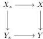

Having strictified the given homotopy pushouts and homotopy pullbacks, we proceed as follows. The maps $X_{00} \to X_{01}$ and $X_{00} \to X_{10}$ are levelwise complemented inclusions by Proposition 3.17. The bottom pushout is van Kampen by part (i) of Corollary 2.12. In particular, the right and front faces are pullbacks. For them to be homotopy pullbacks, it suffices for $X_{11} \to Y_{11}$ to be a fibration. This holds by part (ii) of Lemma 3.18. $\square$

**Proposition 10.2** (Model structure descent for coproducts). *Let $\mathcal{E}$ be an $\alpha$-extensive category, $X \to Y$ a morphism in $\mathfrak{s}\mathcal{E}$ and $S$ an $\alpha$-small set. Given a square*

*for each $s \in S$ such that the induced morphism $\coprod_s Y_s \to Y$ is a weak equivalence, the following are equivalent:*

- (i) *the square above is a homotopy pullback for each $s \in S$,*
- (ii) *the induced morphism $\coprod_s X_s \to X$ is a weak equivalence.*

*Proof.* This follows from a simpler variant of the previous argument, for $\alpha$-small coproducts instead of pushouts. This uses part (i) instead of part (ii) of Lemma 3.18. $\square$

Propositions 10.1 and 10.2 have an immediate counterpart at the $\infty$-categorical level.

**Theorem 10.3.** *Let $\mathcal{E}$ be an $\alpha$-extensive category. The $\infty$-category $\mathrm{Ho}_{\infty}(\mathfrak{s}\mathcal{E})$ has all $\alpha$-small colimits. These colimits satisfy descent.*

*Proof.* It follows from [Cis20, Proposition 7.5.18] that $\mathrm{Ho}_{\infty}(\mathfrak{s}\mathcal{E})$ has finite limits and that finite homotopy limits in $\mathfrak{s}\mathcal{E}$ are sent to limits in $\mathrm{Ho}_{\infty}(\mathfrak{s}\mathcal{E})$, the dual also holds for finite (homotopy) colimits. Moreover, one can deduce the same for $\alpha$-coproducts using [Cis20, Proposition 7.7.1 and Theorem 7.5.30]. This, together with Propositions 10.1 and 10.2 immediately implies that pushouts and $\alpha$-coproducts satisfy descent in $\mathrm{Ho}_{\infty}(\mathfrak{s}\mathcal{E})$. From there, [Lur09, Proposition 4.4.2.6] shows that the existence of finite colimits and $\alpha$-coproducts implies the existence of all $\alpha$-small colimits in $\mathrm{Ho}_{\infty}(\mathfrak{s}\mathcal{E})$. And given that a certain colimit satisfies descent if and only if it is preserved by the contravariant functor from $\mathrm{Ho}_{\infty}(\mathfrak{s}\mathcal{E})$ to the $\infty$-category of $\infty$-categories classified by the slice fibration, [Lur09, Proposition 4.4.2.7] shows that this implies that all $\alpha$-small colimits satisfy descent. $\square$

We now move on to consider right properness of the effective model structure, which will be the key to transfer local Cartesian closure from $\mathcal{E}$ to $\mathrm{Ho}_{\infty}(\mathfrak{s}\mathcal{E})$.

**Proposition 10.4.** *Let $\mathcal{E}$ be a countably lextensive category. The effective model structure on $\mathfrak{s}\mathcal{E}$ is right proper.*

*Proof.* This follows from Proposition 7.6 using the argument in [GSS19, Proposition 4.1, Second proof]. $\square$

51