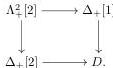
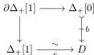
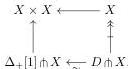

*Proof.* First, note that if $\mathcal{E}$ is countably lextensive, this follows from Lemmas 12.1 and 12.3. If $\mathcal{E}$ is merely finitely complete, then $\mathsf{Fam}_{\omega_1}\mathcal{E}$ is countably lextensive and the conclusion holds since the functor $\mathsf{s}_\varepsilon\mathcal{E} \to \mathsf{s}_\varepsilon\mathsf{Fam}_{\omega_1}\mathcal{E}$ is fully faithful, cf. the explicit construction of $\mathsf{Fam}_\alpha$ in Example 2.5. $\square$

A morphism $X \to Y$ between Kan complexes in $\mathsf{s}_\varepsilon\mathcal{E}$ is a *pointwise weak equivalence* if

$$\operatorname{Hom}_{\mathsf{s}_\varepsilon\operatorname{Set}}(E, X) \to \operatorname{Hom}_{\mathsf{s}_\varepsilon\operatorname{Set}}(E, Y)$$

is a weak equivalence in $\mathsf{s}_\varepsilon\operatorname{Set}$ for all $E \in \mathcal{E}$.

**Theorem 12.5.** *Pointwise weak equivalences, fibrations and trivial fibrations equip the category of Kan complexes in $\mathsf{s}_\varepsilon\mathcal{E}$ with the structure of a fibration category.*

*Proof.* The proof is entirely analogous to the proof of Theorem 1.7 except for the construction of path objects. A path object on $X \in \mathsf{s}_\varepsilon\mathcal{E}$ can be constructed as $X \to \Delta_+[1] \cap X \to X \times X$ as before. However, there is no semisimplicial map $\Delta_+[1] \to \Delta_+[0]$ (i.e., $\Delta_+[0]$ does not admit a cylinder object) and so the morphism $X \to \Delta_+[1] \cap X$ cannot be induced by functoriality of cotensors. The problem can be fixed by constructing a “weak cylinder object” on $\Delta_+[0]$ in the sense of [Hen18].

There is a unique map $\Lambda_+^2[2] \to \Delta_+[1]$. It sends both 1-simplices to the unique 1-simplex of $\Delta_+[1]$. We define $D$ to be the pushout of this map along the trivial cofibration $\Lambda_+^2[2] \to \Delta_+[2]$:

Thus $D$ has two 0-simplices $b$ and $x$, two 1-simplices $f: b \to x$ and $e: b \to b$ and a unique 2-simplex that witnesses that $f \circ e \sim e$. Informally speaking, this forces $e$ to behave as an “identity cell” of $b$. More precisely, we obtain a diagram

which upon cotensoring into $X \in \mathsf{s}_\varepsilon\mathcal{E}$ yields

When $X$ is a Kan complex, the right vertical morphism is a trivial fibration and hence it has a section by Corollary 12.4. We obtain the required factorisation by composing $D \cap X \xrightarrow{\sim} \Delta_+[1] \cap X$ with such section. This last map is a pointwise weak equivalence, because applying $\operatorname{Hom}_{\mathsf{s}_\varepsilon\operatorname{Set}}(E, -)$ to it gives, up to isomorphism, the map

$$D \cap \operatorname{Hom}_{\mathsf{s}_\varepsilon\operatorname{Set}}(E, X) \to \Delta_+[1] \cap \operatorname{Hom}_{\mathsf{s}_\varepsilon\operatorname{Set}}(E, X)$$

58