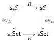

which is a semisimplicial weak equivalence for each fibrant semisimplicial set $\operatorname{Hom}_{\mathfrak{s},\operatorname{Set}}(E, X)$, for example because both evaluation maps to $\operatorname{Hom}_{\mathfrak{s},\operatorname{Set}}(E, X)$ are trivial fibrations as the weak factorisation systems on $\mathfrak{s},\operatorname{Set}$ are compatible to the monoidal structure on $\mathfrak{s},\operatorname{Set}$ (see for eg. Theorem 5.5.6.(iii) of [Hen19]).

The following theorem is the main result of this section. It is valid under two separate sets of assumptions which require two independent proofs. Thus we will consider them separately as Theorem 12.8 and Theorem 12.17.

**Theorem 12.6.** *If $\mathcal{E}$ is either countably extensive or countably complete, then the forgetful functor $\mathfrak{s}\mathcal{E} \rightarrow \mathfrak{s},\mathcal{E}$ induces an equivalence of fibration categories between the fibration categories of Theorems 1.7 and 12.5.*

We start with the case of a category $\mathcal{E}$ with countable limits, this is the proof that relies on the adjunction $U \dashv R$.

**Proposition 12.7.** *If $\mathcal{E}$ is countably complete, then the forgetful functor $U: \mathfrak{s}\mathcal{E} \rightarrow \mathfrak{s},\mathcal{E}$ has a right adjoint $R$. Moreover, for every object $E \in \mathcal{E}$, evaluation at $E$ commutes with this right adjoint, i.e., the square*

*commutes (up to canonical isomorphism).*

*Proof.* We claim that for any $X \in \mathfrak{s},\mathcal{E}$, seen as a functor $\Delta_{+}^{\mathrm{op}} \rightarrow E$, its right Kan extension along $\Delta_{+}^{\mathrm{op}} \rightarrow \Delta^{\mathrm{op}}$ exists and is a pointwise right Kan extension. Indeed, the pointwise right Kan extension computed at $[n] \in \Delta$ should be

$$RV = \lim_{[m] \rightarrow [n] \in E} V([m])$$

where $E$ is the comma category of $[m] \in \Delta_{+}^{\mathrm{op}}$ endowed with a map $[m] \rightarrow [n]$ in $\Delta$. This category is countable, so as $\mathcal{E}$ is countably complete, the limit exists, and hence the pointwise right Kan extension exists. By definition taking this right Kan extension is right adjoint to the forgetful functor $\mathfrak{s}\mathcal{E} \rightarrow \mathfrak{s},\mathcal{E}$, so this proves the existence of the right adjoint. The commutation of the square in the proposition is because the evaluation functor preserves limits, and hence preserves this pointwise right Kan extension as well. $\square$

**Theorem 12.8.** *If $\mathcal{E}$ is countably complete, then both the forgetful functor and its right adjoint*

$$U: \mathfrak{s}\mathcal{E} \leftrightarrows \mathfrak{s},\mathcal{E}: R$$

*restrict to equivalences of fibration categories between $\mathfrak{s}\mathcal{E}_{\mathrm{fib}}$ and $\mathfrak{s},\mathcal{E}_{\mathrm{fib}}$.*

*Proof.* The theorem is valid for simplicial and semisimplicial sets, i.e., in the case of $\mathcal{E} = \operatorname{Set}$. As both $U$ and $R$ commute with evaluation at $E \in \mathcal{E}$ and weak equivalences and fibrations are detected by these evaluations, it follows that:

- $U$ and $R$ preserve fibrant objects and are morphisms of fibrations categories;

59