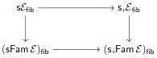

**Theorem 13.4.** *For any category $\mathcal{E}$ with finite limits, the functor $\mathfrak{s}_{\mathfrak{c}}\mathcal{E}_{\mathrm{fib}} \to (\mathfrak{s}_{\mathfrak{c}}\mathsf{Fam}\mathcal{E})_{\mathrm{fib}}$ is fully faithful on the homotopy categories.*

*Proof.* The homotopy category of $\mathfrak{s}_{\mathfrak{c}}\mathcal{E}_{\mathrm{fib}}$ is the quotient by the homotopy relation defined via maps $X \to \Delta_{+}[1] \pitchfork Y$. This follows since all semisimplicial objects are cofibrant and $\mathfrak{s}_{\mathfrak{c}}\mathcal{E}_{\mathrm{fib}}$ is a path category in the sense of [BM18a]. The functor $\mathfrak{s}_{\mathfrak{c}}\mathcal{E}_{\mathrm{fib}} \to (\mathfrak{s}_{\mathfrak{c}}\mathsf{Fam}\mathcal{E})_{\mathrm{fib}}$ preserves finite limits and hence it preserves cotensors by $\Delta_{+}[1]$. Thus morphisms in $\mathfrak{s}_{\mathfrak{c}}\mathcal{E}_{\mathrm{fib}}$ are homotopic in $\mathfrak{s}_{\mathfrak{c}}\mathcal{E}_{\mathrm{fib}}$ if and only if they are homotopic in $\mathfrak{s}_{\mathfrak{c}}\mathsf{Fam}\mathcal{E}_{\mathrm{fib}}$. $\square$

**Remark 13.5.** The crucial difference between semisimplicial and simplicial settings is that every semisimplicial object in $\mathfrak{s}_{\mathfrak{c}}\mathcal{E}$ is cofibrant in $\mathfrak{s}_{\mathfrak{c}}\mathsf{Fam}\mathcal{E}$. However, a non-constant simplicial object in $\mathfrak{s}\mathcal{E}$ is levelwise connected in $\mathfrak{s}\mathsf{Fam}\mathcal{E}$ and thus not cofibrant by Theorem 4.6.

We are now ready to prove Theorem 13.1.

*Proof of Theorem 13.1.* We always have a diagram of functors:

Theorem 12.17 shows that the bottom horizontal functor is always an equivalence of the homotopy categories as $\mathsf{Fam}\mathcal{C}$ is always a completely lextensive category. The top horizontal map is also an equivalence on the homotopy categories by Theorem 12.6 since $\mathcal{E}$ is countably lextensive or countably complete. Finally, we have shown in Theorem 13.4 that the right vertical functor is fully faithful on the homotopy categories. It follows that the left vertical functor is also fully faithful on the homotopy categories, and hence by Lemma 13.3 induces a fully faithful embedding of $\infty$-categories $\mathfrak{s}\mathcal{E}_{\mathrm{fib}} \to (\mathfrak{s}\mathsf{Fam}\mathcal{E})_{\mathrm{fib}}$.

Now, $\mathsf{Fam}\mathcal{E}$ is a locally connected completely lextensive category, and $\mathcal{E}$ is its category of connected objects. Hence, by Theorem 11.7, the $\infty$-category $\mathrm{Ho}_{\infty}(\mathfrak{s}\mathsf{Fam}\mathcal{E})_{\mathrm{fib}}$ is equivalent to the category of presheaves of spaces over $\mathcal{E}$, which proves the first half of the theorem.

For the description of the essential image we simply investigate the precise nature of the embedding constructed above. If $X \in \mathfrak{s}\mathcal{E}_{\mathrm{fib}}$ then its image in $(\mathfrak{s}\mathsf{Fam}\mathcal{E})_{\mathrm{fib}}$ is also fibrant, and the objects corresponding to $E \in \mathcal{E}$ are cofibrant, so, as this is a simplicial model category, the Hom space in the corresponding $\infty$-category between them is simply $\mathrm{Hom}_{\mathfrak{s}\mathrm{Set}}(E, X)$. Hence $X$ is sent to the presheaf of spaces $E \mapsto \mathrm{Hom}_{\mathfrak{s}\mathrm{Set}}(E, X)$. Note that as colimits in presheaf categories are computed levelwise and the colimit of a simplicial set in the $\infty$-category of spaces is the spaces represented by this simplicial sets, this can equivalently be expressed as the fact that $X$ is sent to its geometric realisation in the presheaf category. $\square$

## Appendix A Remarks on constructivity

While the present paper has been written within ZFC for simplicity, many of our results and proofs are constructive, i.e., do not rely on the law of excluded middle or the axiom of choice, subject to some clarifications, which we will discuss briefly here.

64