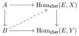
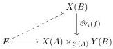

Proof. Note that the functors $X(-): \mathfrak{sSet}^{\mathrm{op}} \to \mathcal{E}$ and $\operatorname{Hom}_{\mathfrak{sSet}}(-, X): \mathcal{E}^{\mathrm{op}} \to \mathfrak{sSet}$ are contravariantly adjoint. Thus for all maps $i: A \to B$ between finite simplicial sets there is a bijective correspondence between the lifting problems

the latter of which is equivalent to the morphism on the right being a split epimorphism (by setting $E = X(A) \times_{Y(A)} Y(B)$).

If $i: A \to B$ is a map of finite simplicial sets and $p: X \to Y$ is a morphism of $\mathfrak{sE}$, then we define the pullback cotensor of $i$ and $p$ (cf. Remark 1.2) as the induced morphism

$$i \widehat{\cap} p: B \cap X \to (A \cap X) \times_{A \cap Y} (B \cap X).$$

# Lemma 1.5.

(i) The pullback cotensor in \(\mathfrak{sE}\) of a cofibration between finite simplicial sets and a fibration is a fibration. If the given cofibration or fibration is trivial, then the result is a trivial fibration.
(ii) Fibrations and trivial fibrations in \(\mathfrak{sE}\) are closed under composition, pullback, and retract.
(iii) Let \( f \colon X \to Y \) and \( g \colon Y \to Z \) be morphisms of \( \mathfrak{sE} \). If \( f \colon X \to Y \) and \( gf \colon X \to Z \) are trivial fibrations, then so is \( g \colon Y \to Z \).

Proof. All the statements are proved in the same way: they hold for simplicial sets (see, e.g., [Qui67, Theorem II.3.3]) and transfer to $\mathfrak{sE}$ using Proposition 1.4. Note that transferring (i) from $\mathfrak{sSet}$ to $\mathfrak{sE}$ relies on the fact that $\operatorname{Hom}_{\mathfrak{sSet}}(E, -)$ preserves pullbacks and cotensors and hence pullback cotensors.

Definition 1.6. Let $f: X \to Y$ in $\mathfrak{sE}$. We say that $f$ is a pointwise weak equivalence if

$$\operatorname{Hom}_{\mathfrak{sSet}}(E, f): \operatorname{Hom}_{\mathfrak{sSet}}(E, X) \to \operatorname{Hom}_{\mathfrak{sSet}}(E, Y)$$

is a weak equivalence in $\mathfrak{sSet}$ for all $E \in \mathcal{E}$.

For the next theorem, we use the definition of a fibration category as stated in [GSS19, Section 1.6].

Theorem 1.7. Let $\mathcal{E}$ be category with finite limits. Then pointwise weak equivalences, Kan fibrations and trivial Kan fibrations equip the category of Kan complexes in $\mathfrak{sE}$ with the structure of a fibration category.

Proof. Trivial fibrations are exactly the fibrations that are weak equivalences because this holds in $\mathfrak{sSet}$. We need to verify the following axioms.

Constructively, part (i) is true in $\mathfrak{sSet}$ by [GSS19, Corollary 1.3.4], part (ii) is evident and part (iii) is [GSS19, Lemma 1.3.6].

7