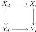

## 2 Lextensive categories and complemented inclusions

This section, Section 3 and Section 4 constitute the second part of the paper, whose ultimate goal is to construct two weak factorisation systems on $\mathfrak{s}\mathcal{E}$, whose right classes of maps are the fibrations and trivial fibrations of Section 1, assuming that $\mathfrak{s}\mathcal{E}$ is a countably lextensive category. This section recalls some basic facts about lextensive categories. Throughout it, we consider a fixed category with finite limits $\mathcal{E}$ and study diagrams in $\mathcal{E}$ indexed by a category $D$. When convenient, we will regard cones under such diagrams as diagrams over the category $D^{\triangleright}$, obtained by adding a new terminal object $\star$ to $D$. We start by recalling the general notion of van Kampen colimit [Lur09, Rez10] in our setting.

**Definition 2.1.** Let $Y_{\bullet}: D \rightarrow \mathcal{E}$ be a diagram and assume $Y_{\star} = \operatorname{colim}_{d \in D} Y_d$ is its colimit in $\mathcal{E}$. We say that $Y_{\star}$ is

- (i) *universal*, if it is preserved by pullbacks, i.e., if for every map $X_{\star} \rightarrow Y_{\star}$, $X_{\star}$ is the colimit of the induced diagram $X_d = X_{\star} \times_{Y_{\star}} Y_d$.
- (ii) *effective*, if given a Cartesian natural transformation $X \rightarrow Y$, the diagram $X$ has a colimit $X_{\star}$, and all the squares

are pullback squares, i.e., the extended natural transformation over $D^{\triangleright}$ is also Cartesian.

- (iii) *van Kampen*, if it is both universal and effective.

**Lemma 2.2.** A colimit $Y_{\star} = \operatorname{colim}_{d \in D} Y_d$ in $\mathcal{E}$ is van Kampen if and only if it is preserved by the pseudo-functor $\mathcal{E}^{\mathrm{op}} \rightarrow \mathrm{Cat}$ sending each $X \in \mathcal{E}$ to the slice category $\mathcal{E} \downarrow X$ (with morphisms acting by pullbacks). In other words, the slice category $\mathcal{E} \downarrow Y_{\star}$ is the pseudo-limit $\lim_{d \in D} (\mathcal{E} \downarrow Y_d)$.

*Proof.* Pullback along the structure morphisms of $Y_{\star}$ induces a functor $P: \mathcal{E} \downarrow Y_{\star} \rightarrow \lim_d (\mathcal{E} \downarrow Y_d)$. We need to show that this functor is an equivalence if and only if the colimit of $Y_{\bullet}$ is a van Kampen colimit.

An object of $\lim_d (\mathcal{E} \downarrow Y_d)$ can be identified with a Cartesian transformation $X \rightarrow Y$. If colimits of diagrams Cartesian over $Y_{\bullet}$ exist, then taking the colimit yields a left adjoint to the functor above:

$$\operatorname{colim}: \lim_d (\mathcal{E} \downarrow Y_d) \leftrightarrows \mathcal{E} \downarrow Y_{\star}: P.$$

Conversely, we claim that if $P$ has a left adjoint, then the left adjoint computes the colimits of diagrams that are Cartesian over $Y_{\bullet}$. Indeed, assume that the pullback functor $P: \mathcal{E} \downarrow Y_{\star} \rightarrow \lim_d (\mathcal{E} \downarrow Y_d)$ has a left adjoint $X_{\bullet} \mapsto X_{\star}$, and let $Z$ be an arbitrary object of $\mathcal{E}$. A map $X_{\star} \rightarrow Z$ in $\mathcal{E}$ is the same as a map $X_{\star} \rightarrow Z \times Y_{\star}$ in $\mathcal{E} \downarrow Y_{\star}$, which by the adjunction formula is the same as a natural transformation $X_d \rightarrow Z \times Y_d$ over $Y_{\bullet}$, but this is exactly the same as a natural transformation $X_d \rightarrow Z$ in $\mathcal{E}$, and hence this shows that $X_{\star}$ is the colimit of $X_d$.

Now, $Y_{\star}$ is universal if and only if the counit of this adjunction is an isomorphism and it is effective if and only if the unit is an isomorphism. Hence, the colimit $Y_{\star}$ of $Y_{\bullet}$ is van Kampen if and only if the pullback functor described above has a left adjoint such that the unit and counit of the adjunction are isomorphisms, i.e., if and only if it is an equivalence. $\square$

9