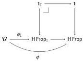
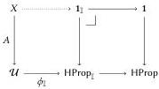
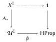

The ∞-category of ∞-categories in simplicial type theory

### C.1 Amazing propositions

Lemma 2.9. If \(\phi :_{\mathfrak{b}} \mathcal{U}^{\mathbb{I}^{n}} \to \mathrm{HProp}\), there is a \(\bar{\phi} :_{\mathfrak{b}} \mathcal{U} \to \mathrm{HProp}\) equipped with a canonical equivalence:

\[
\prod_ {A _ {\mathfrak {b}} X \to \mathcal {U}} \langle b | (x: X) \to \bar {\phi} (A x) \rangle \simeq \langle b | (x: X ^ {\mathbb {I} ^ {n}}) \to \phi (A \circ x) \rangle
\]

PROOF. Fix a predicate \(\phi :_{\mathfrak{b}} \mathcal{U}^{\mathbb{I}} \to \mathrm{HProp}\) (for simplicity, we handle only the case of \(n = 1\) as the case general case is identical modulo notational clutter). We begin by using Axiom 8 to obtain a map \(\phi_{\mathbb{I}} :_{\mathfrak{b}} \mathcal{U} \to \mathrm{HProp}_{\mathbb{I}}\) where \(\mathrm{HProp}_{\mathbb{I}}\) is the unique type arising from applying the amazing right adjoint to HProp. Next, following Gratzer et al. [10, §3.3], we observe that the tautological family \(1_{\mathbb{I}} \to \mathrm{HProp}_{\mathbb{I}}\) is classified by a map \(\mathrm{HProp}_{\mathbb{I}} \to \mathrm{HProp}\) (in particular, it is a small family) and, composing this with \(\phi_{\mathbb{I}}\), we obtain our desired \(\bar{\phi} : \mathcal{U} \to \mathrm{HProp}\). In total, we have the following diagram:

To show that the desired equivalence holds, fix \(A:_{\mathfrak{b}}X \to \mathcal{U}\). We wish to show that \(\prod_{x:X} \bar{\phi}(Ax)\) holds if and only if \(\prod_{x:X^{\mathbb{I}}} \bar{\phi}(A \circ x)\). The former holds if and only if there is a (necessarily unique) extension of the above diagram:

After transposing  \( (-)_{\mathbb{I}} \)  (and discarding the right-hand vertical map as it is redundant for our purposes), we see that the left-hand triangle of this diagram is precisely equivalent to the following:

Examining this diagram yields the desired conclusion.

### C.2 Technical results on iso-inner fibrations

We write Spine \( ^{n} \) for the iterated pushout \( I \sqcup_{1} \ldots \sqcup_{1} I \) which glues together n copies of I attaching 0 to 1 and 1 to 0.

Lemma C.1. If \( f:_{\mathfrak{b}} X \to Y \) is inner it is orthogonal to Spine\( ^{n} \) → \( \Delta^{n} \) for all \( n \geq 2 \).

PROOF. The \(n = 2\) case is by definition, so we proceed by induction. By induction hypothesis, \(\mathrm{Spine}^{n + 1}\to \Delta^n\sqcup_1\mathbb{I}\) is orthogonal

to all inner maps(left maps are closed under pushouts). It suffices to show that \(\Delta^n \sqcup_1 \mathbb{I} \to \Delta^{n+1}\) is orthogonal to all inner maps. Unfolding these conditionals, we must show the following:

\[
\{(v, i) \mid v (n) = 1 \vee i = 0 \} \rightarrow \{(v, i) \mid v (n) \geq i \}
\]

This, in turn, is a retract of \(\mathbb{I}^{n - 1}\times \Lambda_1^2\to \mathbb{I}^{n - 1}\times \Delta^2\)

Lemma C.2. If \(X:_{\mathfrak{b}} \mathcal{U}\) is Segal so too is \(\square X\).

PROOF. For this, we must show that the following map is an equivalence:

\[
\langle b \mid \Delta^ {n} \times \Delta^ {2} \rightarrow \square X \rangle \rightarrow \langle b \mid \Delta^ {n} \times \Lambda_ {1} ^ {2} \rightarrow \square X \rangle
\]

To prove this, we argue that (1) \(\square X\) is \(b\)-orthogonal\(^{5}\) to \(\mathrm{Spine}^{n} \to \Delta^{n}\) and that (2) if a type \(Y:_{\mathfrak{b}} \mathcal{U}_{\square}\) is \(b\)-orthogonal to \(\mathrm{Spine}^{n} \to \Delta^{n}\) so too is \(Y^{\mathbb{I}}\). For the first claim, we note that this follows immediately from simplicial stability (Axiom 7) along with the fact that \(\langle b | - \rangle\) commutes with limits:

\[
\begin{array}{l} \langle b \mid \text { Spine } ^ {n} \to \square X \rangle \\ \simeq \langle b | \mathbb {I} \rightarrow \square X \rangle \times_ {\langle b | \square X \rangle} \langle b | \mathbb {I} \rightarrow \square X \rangle \times_ {\langle b | \square X \rangle} \dots \\ \simeq \langle b | \mathbb {I} \rightarrow X \rangle \times_ {\langle b | X \rangle} \langle b | \mathbb {I} \rightarrow X \rangle \times_ {\langle b | X \rangle} \dots \\ \simeq \langle b \mid \text { Spine } ^ {n} \to X \rangle \\ \end{array}
\]

Consequently, we are reduced to the same question for \( X \to 1 \) which follows from Lemma C.1.

For the second claim, we must show that \(\mathrm{Spine}^n\times \mathbb{I}\to \Delta^n\times \mathbb{I}\) is b-orthogonal to a simplicial \(f\) provided that \(f\) is b-orthogonal to all spine inclusions. To this end, we note the following identifications:

\[
\Delta^ {n} \times \mathbb {I} = \{(v, i): \Delta^ {n} \times \mathbb {I} | \exists k \in \{0, \dots , n + 1 \}. v (k) \geq i \geq v (k + 1) \}
\]

Here, by convention, we treat \( v(0) = 1 \) and \( v(n + 1) = v(n + 2) = 0 \). In what follows, we write \( \Phi_k \) for the condition \( v(k) \geq i \geq v(k + 1) \).

Consequently, to show the desired lifting it suffices to show that there is a unique such lift for  \( \{(v,i):\Delta^{n}\times\mathbb{I}\mid\Phi_{k_{0}}\times\cdots\times\Phi_{k_{l}}\} \) . A moment's thought reveals that each such intersection is a subsimplex of  \( \Delta^{n}\times\mathbb{I} \) . In particular, each  \( \{(v,i)\mid\Phi_{k}\} \)  is  \( \Delta^{n+1} \)  and each higher intersection is a smaller simplex. Moreover, its intersection with  \( Spine^{n}\times\mathbb{I} \)  is either exactly the spine of this smaller simplex (in the cases of  \( \Phi_{0} \)  and  \( \Phi_{n} \)  or higher intersections) or  \( I\sqcup_{1}\ldots\sqcup_{1}\Delta^{2}\sqcup_{1}\ldots \) . In either case, the unique lifting exists by assumption on Y (in the latter case, by 2-for-3 and the closure of left classes under pushouts, as one may see by observing the following decomposition:  \( Spine^{n+1}\to(\mathbb{I}\sqcup_{1}\ldots\sqcup_{1}\Delta^{2}\sqcup_{1}\ldots\sqcup_{1}\mathbb{I})\to\Delta^{n+1} \) ).

Corollary C.3. If \(X:_{\mathfrak{b}} \mathcal{U}\) is simplicial, it suffices to show that it is b-orthogonal to \(\mathrm{Spine}^n \to \Delta^n\) to prove that it is Segal.

Lemma C.4. If \(X:_{\mathfrak{b}} \mathcal{U}\) is Segal and Rezk then \(\square X\) is Rezk.

PROOF. We must show that \(\square X\) is b-orthogonal to \(\mathbb{E} \times \Delta^n \to \Delta^n\) and, since \(\square X\) is Segal, we may reduce immediately to the case where \(n = 0\) or \(n = 1\). The first case is an immediate consequence of simplicial stability, as \(\mathbb{E}\) is built by pushing out various simplices and therefore maps \(\langle b | \mathbb{E} \to \square X \rangle\) correspond to those maps which factor through \(X\).

For the \(n = 1\) case, we must show that diagrams of the following shape in \(X\) are determined by the bottom-most edge

\( ^{5} \) Meaning, orthogonal when we restrict our attention to b-annotated maps