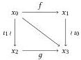

Daniel Gratzer, Jonathan Weinberger, and Ulrik Buchholtz

By simplicial stability along with the previous case, we may safely assume that each of these components (including the relevant 2-cells and section-retraction pairs) all come from \( X \). Moreover, since \( X \) is Segal, the top simplex is redundant. In particular, it is equivalent to the type \( \sum_{\iota_1: \mathbb{B} \to X} \sum_{f: \mathbb{B} \to X} \sum_{p: \iota_1(1) = f(0)} \iota \circ_p f = g \circ \iota_1 \). By the \( n = 0 \) case we have already discussed, we may assume \( \iota_1 = \mathrm{id} \) and replace \( \iota_1: \mathbb{B} \to X \) by simply \( x: \mathbb{B} \to X \). After this replacement, the whole type collapses to a singleton type.

It finally suffices to show that the bottom triangle is equivalent to the bottom edge. However, we may replace this triangle by the corresponding inner horn, whereafter another application of the Rezk condition for n = 0 finishes things off. □

Lemma 5.11. If \(X:_{\mathbb{D}}\mathcal{U}\) is Segal and Rezk, then \(\square X\) is a category.

### C.3 Locally cocartesian families

Lemma C.5. If \(A: X \to \mathcal{U}_{\square}\) is an iso-inner fibration, then a dependent edge \(a: (i: \mathbb{I}) \to A(xi)\) over \(x: \mathbb{I} \to X\) is locally cocartesian if and only if the following map is an equivalence:

\[
a ^ {*}: \left(\sum_ {f: \mathbb {I} \rightarrow A (x 1)} f (0) = a (1)\right)\rightarrow \left(\sum_ {f: (i: \mathbb {I}) \rightarrow A (x i)} f (0) = a (0)\right)
\]

PROOF. This question is once more restricted to a particular \(x: \mathbb{I} \to X\), we may pull back \(A\) along this map to suppose that \(A: \mathbb{I} \to \mathcal{U}_{\square}\) and that \(a: (i: \mathbb{I}) \to Ai\). In this case, \(a\) is locally cocartesian if and only if the following holds (by definition):

\[
\prod_ {b: (i: \mathbb {I}) \to A i} \prod_ {p: a 0 = b 0} \text { isContr } \left(\sum_ {t: (i, j: \Delta^ {2}) \to A i} t | _ {\Delta_ {0} ^ {2}} = [ a, b, p ]\right)
\]

Fix \( b: (i: \mathbb{I}) \to Ai \) and \( p: a0 = b0 \). Then \( \sum_{t: (i,j:\Delta^2) \to Ai} t|_{\Delta_0^2} = [a, b, p] \) is equivalent (by innerness) to \( c: \mathbb{I} \to A1 \) along with \( q: c(0) = a(1) \), \( \theta: c \circ_q a = b \), and \( \theta_0: \mathrm{ap}_{-(0)}(\theta) = p \). However, this is precisely the fiber of \( a^* \), so an edge is locally cocartesian if and only if each fiber of \( a^* \) is contractible.

Theorem 3.8. If \(A: X \to \mathcal{U}_{\square}\) is iso-inner and locally cocartesian where locally cocartesian edges compose, then locally cocartesian edges are cocartesian and \(A\) is cocartesian.

PROOF. We wish to show that \(\Lambda_0^2\to \Delta^2\) is orthogonal to \(\tilde{A}\rightarrow X\) if the \(0\to 1\) edge of \(\Lambda_0^2\) is sent to a locally cocartesian edge. Since this property can be tested after pulling back \(\sum_{x:X}Ax\to X\), we may assume that \(X = \Delta^2\) and concern ourselves only with the tautological 2-simplex. Moreover, in this situation \(\sum_{x:X}Ax\) is a (simplicial) category.

Let us now fix \([f, g, p] : \Lambda_0^2 \to \sum_{x: X} Ax\) which lifts id such that \(f\) is locally cocartesian. Let us write \(x = f(0)\), \(y = f(1)\), and \(z = g(1)\). With this notation, \(p : x = g(0)\).

We wish to show that \([f, g, p]\) extends uniquely to a 2-simplex (such a 2-simplex will necessarily lie correctly over the unique non-degenerate 2-simplex in \(X\) and—since \(X\) is a set—there is no interesting data in how it lies over this simplex). To this end, it suffices

to show that the following map is an equivalence [5, Proposition 5.1.10]:

\[
f ^ {*}: \hom (y, z) \to \hom (x, z)
\]

If so, we may choose the (unique) preimage of  \( (g,p,\text{refl}) \)  to conclude the proof. Now, let us choose a locally cocartesian lift of  \( (1,-):\mathbb{I}\to\Delta^{2} \)  with starting point y. This is a morphism  \( h' \) . Let us write w for the target of  \( h' \) . Since  \( h'\circ f \)  is locally cocartesian by assumption, we conclude that the following maps are equivalences by Lemma C.5:

\[
(h ^ {\prime} \circ f) ^ {*}: \hom (w, z) \to \hom (x, z) \quad h ^ {\prime *} \colon \hom (w, z) \to \hom (y, z)
\]

By 3-for-2, the same is then true of \( f^{*} : \hom(y, z) \to \hom(x, z) \) as required.

Lemma 4.1. If \(A: X \to \mathcal{U}_{\square}\) is iso-inner, then hasLCCLifts(A) and LCCLiftsCompose(A) are propositions.

PROOF. Note that it suffices to prove that for all \(x: \mathbb{I} \to X\) (respectively, \(x: \mathbb{I}^2 \to X\)) that hasLCCLifts(A \(\circ x\)) (respectively, LCCLiftsCompose(A \(\circ x\))) is a proposition.

Only the first of these obligations is non-trivial, since isLocallyCoCart is manifestly valued propositions. Note that if \(a\) and \(a'\) are both locally cocartesian lifts, then by construction there is a unique vertical isomorphism \(\iota : a(1) \cong a'(1)\) such that \(\iota \circ a = a'\). We may then consider these as isomorphic arrows in the fiber \(\mathbb{I} \times_X \sum_{x: X} Ax\), which is a category by iso-innerness. Consequently, \(a = a'\) in the fiber \(\mathbb{I} \times_X \sum_{x: X} Ax\) whereby they are equal in \(\sum_{x: X} Ax\). The type of locally cocartesian lifts is therefore a proposition as required.

### C.4 The directed gluing of cocartesian fibrations

Lemma 3.9. If X is simplicial, then  \( \mathrm{Gl}(F_{0}, F_{1}, \alpha) \)  is iso-inner.

PROOF. First, we note by elementary manipulation of closure properties, it suffices to consider the case where \( F_{1} = \lambda_{-}.1 \) (use the 3-for-2 fact available for iso-inner families with the factorization \( \mathrm{Gl}(F_0,F_1,\alpha)\to (\sum_{x:X}F_1(x))\times \mathbb{I}\to X\times \mathbb{I}) \).

We must show that \(\mathrm{Spine}^n\to \Delta^n\) is b-orthogonal to \(\mathrm{Gl}(F_0,F_1,\alpha)\) by Corollary C.3. To this end, fix a map \(b:\mathbb{I}_{\mathbb{D}}\Delta^{n}\to X\times \mathbb{I}\) along with a partial section:

\[
s _ {0}: _ {\mathbb {D}} (v: \operatorname{Spine} ^ {n}) \to \operatorname{Gl} (F _ {0}, F _ {1}, \alpha) (b (v))
\]

We must show that \( s_0 \) extends uniquely. Let us begin by investigating \( i = \pi_1 \circ b \), a \( b \)-annotated map \( \Delta^n \to \mathbb{I} \). By duality, such a map corresponds to a \( b \) element of \( \mathbb{I}[x_0 \leq \cdots \leq x_n] \) so it is either 0, 1, or \( x_k \) for some particular \( 0 \leq k \leq n \). If we are in the case of \( i = \lambda_{-}.0 \) or \( i = \lambda_{-}.1 \), then the conclusion is immediate from the innerness of \( F_0 \). If we are instead in the case where \( i = \text{dual}(x_k) \), we must proceed differently. We note that in such a case, \( i(v) = 0 \) if and only if \( v_k = 0 \). This means that \( s_0 \) has the type \( (v: \text{Spine}^k) \to F_0(b(v, 0, \ldots)) \) and we must construct a unique extension \( s \) of type \( (v: \Delta^k) \to F_0(b(v, 0, \ldots)) \). This is immediate by the innerness of \( F_0(b(-, 0, \ldots)) \) which in turn is a consequence of the innerness of \( F \).

To show the “iso” part of iso-innerness, we note that this can be checked fiberwise. However, over each fiber, this is immediate by the fact that Rezk types are an exponential ideal and  \( F_{0} \)  is iso-inner.