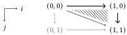

The $\infty$-category of $\infty$-categories in simplicial type theory

give a number of consequences of our results, including a proof of straightening–unstraightening (Corollary 6.6). For reasons of space we have omitted various technical details and proofs from the main body of the paper; most of these are recorded in the appendix.

## 2 Simplicial and triangulated type theory

We now turn to giving a more precise account of the flavor of simplicial type theory we shall use. There are two major modifications to the theory compared with the original system studied by Riehl and Shulman [33]. First is that we supplement our theory with a collection of modalities, including the $b$ modality discussed in the introduction. We do this using MTT, a general purpose modal dependent type theory [9]. Secondly, the intended model of STT is simplicial spaces, the $\infty$-categorical version of $\mathrm{PSh}(\Delta)$. However, in order to leverage the techniques of Licata et al. [18] to define Cat, we require a postulated amazing right adjoint to $\mathbb{I} \to -$. Unfortunately, in the intended model of simplicial spaces, such a right adjoint simply does not exist; the category of simplices does not have products.

To circumvent this, Gratzer et al. [10] introduced a further relaxation of the modal variant of STT: triangulated type theory $\mathrm{TT}_{\square}$. The intended model of $\mathrm{TT}_{\square}$ is Dedekind cubical spaces, rather than simplicial ones. Simplicial spaces embed into this intended model as a subtopos and the original structure therefore remains. Concretely, this change involves relaxing the requirement that $\mathbb{I}$ be totally ordered to merely asking it to be a bounded distributive lattice. In this section, we recall the details of $\mathrm{TT}_{\square}$ relevant for this work and, in particular, describe the modal extensions necessary to construct the category of categories.

### 2.1 First steps in triangulated type theory

As mentioned in Section 1, STT and its relaxation $\mathrm{TT}_{\square}$, extend homotopy type theory. Accordingly, we begin by recalling the basic definitions and notations from homotopy type theory. For a more complete account, see the Univalent Foundations Program [39].

Homotopy type theory begins with intensional Martin-Löf type theory, complete with a hierarchy of universes, $\mathcal{U}_0, \mathcal{U}_1, \ldots$, and intensional identity types $a =_A b$. We use $\prod$ and $\sum$ for the standard dependent product and sum types of this type theory and use $p$ for the transport map $B(x) \to B(y)$ induced by $p : x = y$. The key extension of HoTT, the univalence axiom, governs the behavior of the intensional identity type of the universe. In particular, this axiom relates equality in the universe to equivalences. See op. cit. for a detailed discussion of the type of equivalences $A \simeq B$; we only note that it is a subtype of $A \to B$ which, when $A = B$, includes the identity function.

Axiom 1. The canonical map $A =_{\mathcal{U}_i} B \to A \simeq B$ sending refl to id is an equivalence.

We shall also have use for a few other HoTT concepts. First, since univalence causes the unicity of identity proofs to fail rather spectacularly, so we isolate those types for which this property still holds as (homotopy) sets. We will also use for the stronger properties of being a (homotopy) proposition, or contractible:

$$\operatorname{isSet}(A) = \prod_{a,b:A} \operatorname{isProp}(a = b)$$

$$\operatorname{isProp}(A) = \prod_{a,b:A} \operatorname{isContr}(a = b)$$

$$\operatorname{isContr}(A) = \sum_{a:A} \prod_{b:A} a = b$$

If $\phi : \mathcal{U} \to \mathcal{U}$ is valued in propositions, we write $\mathcal{U}_\phi$ for $\sum_{A:\mathcal{U}} \phi(A)$. Moreover, we use HProp as condensed notation for $\mathcal{U}_{\mathrm{isProp}}$.

Next, we require a few higher inductive types (HITs). These are inductive types that postulate constructors not only of elements of the type, but also of elements of its identity type. For instance, we shall use pushouts $A +_B C$ and localizations as defined by Rijke et al. [34]. Since the models of HITs satisfying strict equations is somewhat fraught, we only assume that our HITs satisfy propositional computation rules, i.e., that they are homotopy-initial algebras.

We now turn to the first and most basic axiom of triangulated type theory, which introduces the directed interval.

Axiom 2. There is a set $\mathbb{I}$ equipped with the structure of a bounded distributive lattice $(0, 1, \wedge, \vee)$ such that $0 \neq 1$.

Crucially, compared with STT we do not assume that $\prod_{i,j:\mathbb{I}} i \leq j \vee j \leq i$ holds. However, just as with the failure of UIP, we may isolate those types that "believe $i \leq j \vee j \leq i$" as simplicial types. These are types $A$ such that the following holds:

$$\operatorname{isSimp}(A) = \prod_{i,j:\mathbb{I}} \operatorname{isEquiv}(\operatorname{const} : A \to (i \leq j \vee j \leq i \to A))$$

The next result follows from Rijke et al. [34]:

Proposition 2.1. There is a lex idempotent monad $\square : \mathcal{U} \to \mathcal{U}$ with $\square A$ universal among simplicial types receiving a map from $A$.

In other words, ordinary simplicial type theory is the "subset of $\mathrm{TT}_{\square}$" given by types for which $\eta_A : A \to \square A$ is an equivalence. We write $\mathcal{U}_{\square} = \sum_{A:\mathcal{U}} \operatorname{isEquiv}(\eta_A)$ for the subtype of $\mathcal{U}$ spanned by simplicial types and note that $\mathcal{U}_{\square}$ is itself simplicial. Consequently, there is a unique $\bar{\square} : \square \mathcal{U} \to \mathcal{U}_{\square}$ such that $\bar{\square} \circ \eta = \square$.

With $\mathbb{I}$, we can make a number of important definitions that isolate those types that actually behave like categories. First, as mentioned earlier, we can define a synthetic morphism in a type $A$ to be a map $\mathbb{I} \to A$. Constraining the endpoints of this map, we arrive at the definition of the synthetic hom-type:

$$\hom_A(a, b) = \sum_{f:\mathbb{I}\to A} f \, 0 = a \times f \, 1 = b$$

Every type comes equipped with a collection of identity morphisms: $\operatorname{id}_a = \lambda_-.a : \hom(a, a)$. However, the other operation we expect from a category–composition–is not available by default. What is available instead is a proof-relevant composition relation, stating that a pair of synthetic morphisms compose to a third. To define these, we derive the 2-simplex $\Delta^2$ from $\mathbb{I}$. For the sake of future use, we define the $n$-simplex for any $n \geq 0$:

$$\Delta^n = \sum_{\bar{i}:\mathbb{I}^n} (i_0 \geq i_1 \geq \dots \geq i_{n-1})$$

Crucially, the 2-simplex can be visualized as a triangle (the shaded region below), if $\mathbb{I}$ is seen as a line segment whence $\mathbb{I}^2$ as a square:

We also have need for the inner horn $\Lambda_1^2 = \sum_{i,j:\mathbb{I}} i = 1 \vee j = 0$, a subtype of $\Delta^2$ which captures the two highlighted segments above.

Say that $\tau : \Delta^2 \to A$ is a witness for the fact that $\tau(-, 0), \tau(1, -) : \mathbb{I} \to A$ compose to $\lambda i. \tau(i, i)$. A Segal type (sometimes called a pre-category) is one where every pair of composable arrows admits a