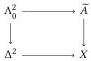

The \(\infty\)-category of \(\infty\)-categories in simplicial type theory

map \(\widetilde{A}^{\Lambda_0^2}\times_{\Lambda_0^2\to X}X^{\Delta^2}\to \widetilde{A}^{\{\tilde{0}\to \tilde{1}\}}\) commute with \(\rho^A\), so we may view \(\rho^A\) as a map between two families of types over \(\mathbb{I}\rightarrow \widetilde{A}\). Given \(x:\mathbb{I}\rightarrow \widetilde{A}\), we denote by \(\rho_x^A\) the restriction of \(\rho^A\) to the fibers of these families over \(x\).

Definition 3.1. A morphism \( f: \mathbb{I} \to \widetilde{A} \) is cocartesian in \( A \) (written is \( \operatorname{CocartArr}_A(f) \)) if \( \rho_f^A \) is an equivalence.

Informally, \( f: \mathbb{I} \to \widetilde{A} \) is cocartesian if diagrams of the following shape have a unique lift whenever \( \Delta^{\{\tilde{0}\to\tilde{1}\}} \to \Delta^2 \to \widetilde{A} \) is \( f \):

Definition 3.2. A family \(A: X \to \mathcal{U}\) is cocartesian if it is iso-inner, each \(A(x)\) is simplicial, and the following holds:

\[
\prod_ {u: \mathbb {I} \rightarrow X} \prod_ {a: A (u 0)} \sum_ {f: \hom_ {a} ^ {A} (a, \bullet)} \text { is   CocartArr } _ {A} (f)
\]

This requirement is a proposition [5] and each fiber of such a family is a category, satisfying the first of our requirements.

Example 3.3. For every category A the codomain map  \( A^{I} \rightarrow A \)  is cocartesian. The domain projection is cocartesian iff A has pushouts.

Remark 3.4. An arrow is vertical if it maps to an isomorphism. In a cocartesian fibration, every arrow factors as “vertical \(\circ\) cocartesian”.

In case that X is a category and A is simplicial and iso-inner, a slick characterization of cocartesian families becomes available.

Proposition 3.5 (Buchholtz and Weinberger [5]). An iso-inner family \(A: X \to \mathcal{U}_{\square}\) over a category \(X\) is cocartesian iff the map \((\widetilde{A})^{\mathbb{I}} \to (\widetilde{A})^{\{\theta\}} \times_{X^{\{\theta\}}} X^{\mathbb{I}}\) has a left adjoint right inverse.\(^4\)

This characterization implies many closure properties such as under composition, pullback, and Leibniz cotensors [5].

For the second desideratum of cocartesian families, we define the cocartesian transport operation, providing the desired functors between fibers. If \( A: X \to \mathcal{U} \) is cocartesian and \( u: \hom(x, y) \), transport \( u: Ax \to Ay \) is defined by mapping \( a: Ax \) to the codomain of the (unique) cocartesian lift of \( u \) starting at \( a \).

Proposition 3.6. If \(A: X \to \mathcal{U}\) is cocartesian, then cocartesian transport is functorial, i.e., \((vu)_{!} = v_{!} \circ u_{!} \text{ and } (\mathrm{id})_{!} = \mathrm{id}\).

Definition 3.7. For \(A, B: X \to \mathcal{U}\) cocartesian, we say that \(f: \prod_{x: X} Ax \to Bx\) is a cocartesian functor if \(f\) preserves cocartesian arrows. We write \(A \to^{\mathrm{cc}} B\) for the type of cocartesian functors.

For our construction of Cat, it will be helpful to develop the theory of locally cocartesian fibrations. These are families \(A: X \to \mathcal{U}\) that are cocartesian after restriction \(A \circ f\) for every \(f: \mathbb{I} \to X\). As setup, for a family \(A: \mathbb{I} \to \mathcal{U}\), we call an edge \(a: (i: \mathbb{I}) \to Ai\) locally cocartesian if the following proposition holds:

\[
\text { isLocallyCoCart }: (A: \mathbb {I} \to \mathcal {U}) \to ((i: \mathbb {I}) \to A i) \to \mathrm{HProp}
\]

\[
\text { isLocallyCoCart } A a = \prod_ {b: (i: \mathbb {I}) \to A i} \prod_ {p: a 0 = b 0}
\]

\[
\operatorname{isContr} \left(\sum_ {t: (i, j: \Delta^ {2}) \rightarrow A i} t | _ {\Lambda_ {0} ^ {2}} = [ a, b, p ]\right)
\]

\( ^{4} \) That is, a left adjoint where the unit map is an isomorphism.

We then define the structure of having locally cocartesian lifts:

\[
\text { hasLCCLifts }: (\mathbb {I} \to \mathcal {U}) \to \mathcal {U}
\]

\[
\text { hasLCCLifts } A = \prod_ {a _ {0}: A 0} \sum_ {a: \hom_ {A} (a _ {0}, \bullet)} \text { isLocallyCoCart } a
\]

Unlike for cocartesian edges, locally cocartesian edges need not compose. Let us quickly isolate what it means for them to do so:

\[
\text { LCCLiftsCompose }: (\Delta^ {2} \rightarrow \mathcal {U}) \rightarrow \text { HProp }
\]

\[
\text { LCCLiftsCompose } A = (a: \prod_ {s: \Delta^ {2}} A s)
\]

\[
\rightarrow \text { isLocallyCoCart } (a (-, 0)) \times \text { isLocallyCoCart } (a (1, -))
\]

\[
\rightarrow \text { isLocallyCoCart } (\lambda i. a (i, i))
\]

We extend the preceding two definitions to general families \(A: X \to \mathcal{U}\) by stating that they hold for \(A\) if they hold for \(A \circ f: \mathbb{I} \to \mathcal{U}\) for all arrows \(f: \mathbb{I} \to X\) (or squares \(h: \mathbb{I} \times \mathbb{I} \to X\), respectively). We overload the predicates, writing, e.g., hasLCCLifts(A) also for a general family \(A\). A locally cocartesian family is one with hasLCCLifts structure.

Theorem 3.8. If \(A: X \to \mathcal{U}_{\square}\) is iso-inner and locally cocartesian where locally cocartesian edges compose, then locally cocartesian edges are cocartesian and \(A\) is cocartesian.

In this case, locally cocartesian lifts are unique, since cocartesian lifts are. This will be important shortly.

### 3.2 The directed gluing of cocartesian families

We close this section by generalizing the directed gluing type inspired by Weaver and Licata [42] and used in this context by Gratzer et al. [10]. Roughly, this type takes two cocartesian families over \(X\) and a cocartesian functor between them and bundles them into a single cocartesian family over \(X \times \mathbb{I}\). This is a key ingredient of our proof of directed univalence, which will eventually amount to a proof that Gl lifts to an equivalence.

Fix cocartesians fibrations \(F_{0}, F_{1}: X \to \mathcal{U}_{\square}\) and a cocartesian functor \(\alpha: \prod_{x: X} F_{0} x \to F_{1} x\). The directed gluing of this data is

\[
\operatorname{Gl} \left(F _ {0}, F _ {1}, \alpha\right): X \times \mathbb {I} \rightarrow \mathcal {U} _ {\square}
\]

\[
\operatorname{Gl} \left(F _ {0}, F _ {1}, \alpha\right) (x, i) = \sum_ {f: F _ {1} (x)} i = 0 \rightarrow \alpha (x) ^ {- 1} (f)
\]

We note that the fibers over  \( (x,0) \)  and  \( (x,1) \)  are given by  \( F_{0}(x) \)  and  \( F_{1}(x) \) , respectively. Moreover, for each  \( w:F_{0}(x) \)  there is a map over  \( \lambda i.(x,i) \)  connecting w to  \( \alpha(x,w) \) . We show that  \( \mathrm{Gl}(F_{0},F_{1},\alpha) \)  is iso-inner over  \( I\times X \)  and that the aforementioned collection of edges make this family cocartesian with transport functor  \( \alpha \) .

In what follows, we assume that \(X, F_0, F_1\) and \(\alpha\) are all \(b\)-annotated. These proofs are all routine applications of orthogonality properties, combined with Lemma 2.13; we give details only in Appendix C.

Lemma 3.9. If X is simplicial, then  \( \mathrm{Gl}(F_{0}, F_{1}, \alpha) \)  is iso-inner.

Lemma 3.10. If X is a category, then  \( \mathrm{Gl}(F_{0}, F_{1}, \alpha) \)  is cocartesian.

Corollary 3.11. Cocartesian transport from \(\mathrm{Gl}(F_0,F_1,\alpha)(-,0)\) to \(\mathrm{Gl}(F_0,F_1,\alpha)(-,1)\) is given by \(\alpha\).

Corollary 3.12. The projection map \(\pi_0: \mathrm{Gl}(F_0, F_1, \alpha) \to F_1 \circ \pi_0\) is a cocartesian functor over \(X \times \mathbb{I}\).