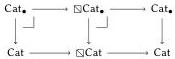

The ∞-category of ∞-categories in simplicial type theory

Thus, a cocartesian family $A \ni_{\flat} X \times \mathbb{I} \to \mathcal{U}$ is fully described by its restrictions to 0 and 1 along with the associated transport map. Combining this classification result in the case where $X = 1$ with Theorem 4.3, we obtain the directed univalence principle:

Corollary 5.5 (Directed univalence). If $A, B$ are $b$-elements of Cat, then there is a equivalence $\text{dua}: \hom_{\text{Cat}}(A, B) \simeq \langle b \mid A \to B \rangle$.

We note that, in general, we actually obtain an equivalence between $\langle b \mid X \times \mathbb{I} \to \text{Cat} \rangle$ and $\langle b \mid \sum_{A_0, A_1: \text{Cat}^X} A_0 \to^{\text{cc}} A_1 \rangle$. For what follows, we also require a similar accounting of cocartesian families $A \ni_{\flat} X \times \Delta^2 \to \mathcal{U}$. The story plays out in much the same way; we define $B_1$ as the following iterated glue type:

$$B_0 = \text{Gl}(A(-, \bar{0}), A(-, \bar{1}), \lambda x. (x, -)_!)$$

$$B_1 = \text{Gl}(B_0, A(-, \bar{2}) \circ \pi_0, \lambda x. (x, \bar{1} \vee - \wedge \bar{2})_! \circ \pi_0)$$

Combining Corollary 3.12 and Lemma 5.2 with Lemma 3.10, we conclude that $B_1$ is a cocartesian family $X \times \mathbb{I}^2 \to \mathcal{U}$. We then take $B$ to be the restriction of $B_1$ to $X \times \Delta^2$. The map of families glue considered previously easily generalizes to this $\Delta^2$ case and we may prove the following:

Lemma 5.6. The map $\text{glue}_2: \prod_{p: X \times \Delta^2} A p \to B p$ is cocartesian.

Again, an application of Lemma 5.1 allows us to conclude that $\text{glue}_2$ is an equivalence. Combining these steps once more with Theorem 4.3 once more, we conclude the following:

Corollary 5.7. Cocartesian transport induces an equivalence $\langle b \mid \text{Cat}^{X \times \Delta^2} \rangle \simeq \langle b \mid \sum_{A_0, A_1, A_2: \text{Cat}^X} A_0 \to^{\text{cc}} A_1 \times A_1 \to^{\text{cc}} A_2 \rangle$.

### 5.2 Cat is Segal and Rezk

Having characterized both cocartesian fibrations over $X \times \Delta^2$ and $X \times \mathbb{I}$ for all categories $X$, it is only slightly more work to prove that Cat is both Segal and Rezk.

Lemma 5.8. Cat is Segal.

PROOF. We wish to show that $\text{Cat}^{\Delta^2} \to \text{Cat}^{\Lambda_1^2}$ is an equivalence. Using Axiom 6, it suffices to show that the following map is an equivalence for all $n: \langle b \mid \mathbb{I}^n \times \Delta^2 \to \text{Cat} \rangle \to \langle b \mid \mathbb{I}^n \times \Lambda_1^2 \to \text{Cat} \rangle$.

Note that $\langle b \mid \mathbb{I}^n \times \Lambda_1^2 \to \text{Cat} \rangle$ is equivalent to the following:

$$\langle b \mid \mathbb{I}^n \times \mathbb{I} \to \text{Cat} \rangle \times_{\langle b \mid \mathbb{I}^n \to \text{Cat} \rangle} \langle b \mid \mathbb{I}^n \times \mathbb{I} \to \text{Cat} \rangle$$

This follows from the fact that $\langle b \mid - \rangle$ has an internal right adjoint ($\langle b \mid - \rangle$) together with the fact that $\Lambda_1^2 = \mathbb{I} \sqcup_1 \mathbb{I}$. Next, since $\mathbb{I}^n$ is a category, the results of the previous section allow us to rephrase the above map into the following:

$$\langle b \mid \sum_{A, B, C: \text{Cat}^{\mathbb{I}^n}} A \to^{\text{cc}} B \times B \to^{\text{cc}} C \rangle \to$$

$$\langle b \mid \sum_{A, B: \text{Cat}^{\mathbb{I}^n}} A \to^{\text{cc}} B \rangle \times_{\langle b \mid \text{Cat}^{\mathbb{I}^n} \rangle} \langle b \mid \sum_{B, C: \text{Cat}^{\mathbb{I}^n}} B \to^{\text{cc}} C \rangle$$

This being an equivalence follows immediately from the fact that $\langle b \mid - \rangle$ preserves pullbacks by virtue of Axiom 3.

Inspecting this proof, we see that if $P: \Lambda_1^2 \to \text{Cat}$, the resulting composed edge $f: \mathbb{I} \to \text{Cat}$ is a cocartesian fibration where $f(0) = P(\bar{0})$, $f(1) = P(\bar{2})$ and cocartesian transport from 0 to 1 is the composite of transporting in $P$ from $\bar{0}$ to $\bar{1}$ and then from $\bar{1}$ to $\bar{2}$.

Lemma 5.9. Cat is Rezk.

PROOF. We wish to show that all synthetic isomorphisms in Cat are equivalent to the identity. Once more, we apply Axiom 6 showing that the restriction map $\langle b \mid \mathbb{I}^n \to \text{Cat} \rangle \to \langle b \mid \mathbb{I}^n \times \mathbb{E} \to \text{Cat} \rangle$ is an equivalence. Commuting $\langle b \mid - \rangle$ with the pushout defining $\mathbb{E}$ once more, we may instead consider the map:

$$\langle b \mid \mathbb{I}^n \to \text{Cat} \rangle$$

$$\to \langle b \mid \text{Cat}^{\mathbb{I}^n \times \Delta^2} \rangle \times_{\dots} \langle b \mid \text{Cat}^{\mathbb{I}^n \times \mathbb{I}} \rangle \times_{\dots} \langle b \mid \text{Cat}^{\mathbb{I}^n \times \Delta^2} \rangle$$

Applying the results of the previous section and commuting $\langle b \mid - \rangle$ past pullbacks, we may recast the above:

$$\langle b \mid \mathbb{I}^n \to \text{Cat} \rangle$$

$$\to \langle b \mid \sum_{A, B: \text{Cat}^{\mathbb{I}^n}} \sum_{f: A \to^{\text{cc}} B} \sum_{g, h: B \to^{\text{cc}} A} f \circ g = \text{id} \times h \circ f = \text{id} \rangle$$

However, since Cat is a subtype of $\mathcal{U}$ it satisfies the univalence axiom. The result then follows from the observation that the data imposed on $f$ ensures that it is a family of equivalences.

### 5.3 Cat is simplicial

Our remaining task is to show that Cat is simplicial. Unfortunately, this is far from immediately obvious. After all, Cat is defined using the amazing right adjoint to $\mathbb{I} \to -$, which is the primary source of non-simplicial types. Fortunately, in this case we may use Theorem 4.3 to produce a left section to $\eta: \text{Cat} \to \boxtimes\text{Cat}$ and this implies that $\eta$ is an equivalence [34, Lemma 1.20].

To begin with, we record the following lemma:

Lemma 5.10. The commuting square between $\text{Cat}_{\bullet} = (\sum_{A: \text{Cat}} A) \to \text{Cat}$ and $\boxtimes\text{Cat}_{\bullet} \to \boxtimes\text{Cat}$ induced by $\eta$ is cartesian.

PROOF. Unfolding definitions and comparing fibers, this follows from the fact that each $A: \text{Cat}$ is simplicial and $\boxtimes$ is lex.

Next, we note that if $\boxtimes\text{Cat}_{\bullet} \to \boxtimes\text{Cat}$ represents a cocartesian family itself, then there must be a unique classifying map $\boxtimes\text{Cat} \to \text{Cat}$ and, pasting together the relevant pullback squares, we obtain the following composite pullback diagram:

By the univalence property of Cat, this bottom composite must be the identity. Consequently, the classifying map $\boxtimes\text{Cat} \to \text{Cat}$ is the required left inverse to the unit. All that remains, therefore, is to prove that $\boxtimes\text{Cat}_{\bullet} \to \boxtimes\text{Cat}$ is a cocartesian fibration.

To prove this we will use Axiom 7 along with Lemma 2.13 and Proposition 3.5. First, we must note that $\boxtimes\text{Cat}$ and $\boxtimes\text{Cat}_{\bullet}$ are both categories. We therefore record the following result:

Lemma 5.11. If $X \ni_{\flat} \mathcal{U}$ is Segal and Rezk, then $\boxtimes X$ is a category.

Lemma 5.12. The family $\boxtimes\text{Cat}_{\bullet} \to \boxtimes\text{Cat}$ is cocartesian.

PROOF. As a map between categories, it is automatically isonner and simplicial. It therefore suffices to prove that the comparison map $(\boxtimes\text{Cat}_{\bullet})^{\mathbb{I}} \to (\boxtimes\text{Cat})^{\mathbb{I}} \times_{\boxtimes\text{Cat}} \boxtimes\text{Cat}_{\bullet}$ has a left adjoint right inverse. For concision, we write $C = \boxtimes\text{Cat}$ and, commute $\boxtimes$ with $\Sigma$ to replace $\boxtimes\text{Cat}_{\bullet}$ with $E = \Sigma_{A: \boxtimes\text{Cat}} \hat{\boxtimes} A$ in what follows.