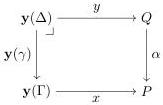

Vol. 17:3

MULTIMODAL DEPENDENT TYPE THEORY

11:21

variance opposite to the specification of $\mathcal{M}$. Of course, this is merely an analogy, as these constructions are not truly adjoint.

### 5.1.2. Types and Context Extension. The following definition plays a central role.

**Definition 5.2** (Representable natural transformation). Let $\mathbb{C}$ be a small category, and let $P, Q : \mathbf{PSh}(\mathbb{C})$ be presheaves on $\mathbb{C}$. A natural transformation $\alpha : P \Rightarrow Q$ is *representable* just if for every $\Gamma : \mathbb{C}$ and $x : \mathbf{y}(\Gamma) \Rightarrow P$ there exists a $y : \mathbf{y}(\Delta) \Rightarrow Q$ and a morphism $\gamma : \Delta \to \Gamma$ in $\mathbb{C}$ such that there is a pullback square

This enables a very succinct definition of a model of type theory [Awo18].

**Definition 5.3.** Let $\mathbb{C}$ be a small category with a terminal object $\mathbf{1}$, and let $\widetilde{\mathcal{T}}, \mathcal{T} : \mathbf{PSh}(\mathbb{C})$. A *natural model of type theory* is a representable natural transformation $\tau : \widetilde{\mathcal{T}} \Rightarrow \mathcal{T}$.

It is shown in *op. cit.* that this corresponds to the usual notion of CwF: the representability of $\tau : \widetilde{\mathcal{T}} \Rightarrow \mathcal{T}$ is a clever way to encode context extension and comprehension in a manner that automatically ensures naturality with respect to substitution: see also [Fio12]. Moreover, one can use this economy to write down very concise interpretations of type formers. Our objective here is to adapt this to modes and modalities.

To begin, given a mode $m \in \mathcal{M}$ we define two presheaves on the context category $\mathcal{C}[m]$:

$$\mathcal{T}_m(\Gamma) \triangleq \mathsf{type}_m^1(\Gamma) \qquad \widetilde{\mathcal{T}}_m(\Gamma) \triangleq \{(A, M) \mid A \in \mathsf{type}_m^1(\Gamma), M \in \mathsf{tm}_m(\Gamma, A)\}$$

The first one maps a context at mode $m \in \mathcal{M}$ to the set of large types over it. The second one maps a context to the set of pointed types, i.e. to the set of pairs consisting of a type and a term of that type. The presheaf action is given by substitution. We immediately obtain a natural transformation $\tau_m : \widetilde{\mathcal{T}}_m \Rightarrow \mathcal{T}_m$: at each context $\Gamma$, $\tau_{m,\Gamma}$ projects a pair $(A, M)$ to the underlying type $A$. As a result, the fibres of $\tau_m$ are the terms of a given type.

Context extension postulates that for any object $\Gamma : \mathcal{C}[m]$, modality $\mu \in \mathrm{Hom}(n, m)$, and large type $A \in \mathsf{type}_n^1([\widehat{\bullet}_\mu]\Gamma)$ there exists an object $\Gamma.(\mu \mid A) : \mathcal{C}[m]$ along with a morphism and a term

$$\mathbf{p} : \mathrm{Hom}_{\mathcal{C}[m]}(\Gamma.(\mu \mid A), \Gamma) \qquad \mathbf{q} \in \mathsf{tm}_n([\widehat{\bullet}_\mu](\Gamma.(\mu \mid A)), A[[\widehat{\bullet}_\mu]](\mathbf{p}))$$

The object $\Gamma.(\mu \mid A)$ is universal with respect to $\mathbf{p}$ and $\mathbf{q}$: for any $\gamma \in \mathrm{Hom}_{\mathcal{C}[m]}(\Delta, \Gamma)$ and term $M \in \mathsf{tm}_n([\widehat{\bullet}_\mu]\Delta, A[\gamma.\widehat{\bullet}_\mu])$ there is a *unique* $\gamma.M : \Delta \to \Gamma.(\mu \mid A)$ such that

$$\mathbf{p} \circ (\gamma.M) = \gamma : \Delta \to \Gamma \tag{5.1}$$

$$\mathbf{q}[(\gamma.M).\widehat{\bullet}_\mu] = M : \mathsf{tm}_n([\widehat{\bullet}_\mu](\Gamma), A[\gamma.\widehat{\bullet}_\mu]) \tag{5.2}$$

As usual, (5.2) is only well-typed because of (5.1). The only difference to the usual context extension of CwFs is that $A$ and $\Gamma$ are in different modes.

This can be encoded in the style of natural models as follows. We write $\lfloor - \rfloor$ for the Yoneda isomorphism. Given $\mu : \mathrm{Hom}_{\mathcal{M}}(n, m)$, context $\Gamma : \mathcal{C}[m]$, and a type $A : \mathsf{type}_n^1([\widehat{\bullet}_\mu](\Gamma))$,