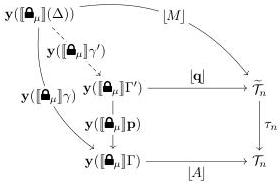
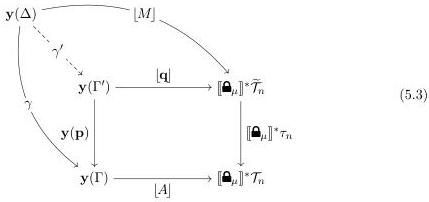

11:22

D. GRATZER, G.A. KAVVOS, A. NUYTS, AND L. BIRKEDAL

Vol. 17:3

there is a chosen context $\Gamma'$ (cf. $\Gamma.(\mu \mid A)$), a chosen morphism $\mathbf{p} : \Gamma' \to \Gamma$, and a chosen morphism $[\mathbf{q}] : \mathbf{y}([\mathbf{\Theta}_{\mu}]\Gamma') \to \widetilde{\mathcal{T}}_n$ that make the following square commute:

$$\begin{array}{c} \mathbf{y}([\mathbf{\Theta}_{\mu}]\Gamma') \xrightarrow{[\mathbf{q}]} \widetilde{\mathcal{T}}_n \\ \mathbf{y}([\mathbf{\Theta}_{\mu}]\mathbf{p}) \Big\downarrow \qquad \qquad \qquad \qquad \qquad \qquad \qquad \qquad \qquad \qquad \qquad \qquad \qquad \qquad \qquad \qquad \qquad \qquad \qquad \qquad \qquad \qquad \qquad \qquad \qquad \qquad \qquad \qquad \qquad \qquad \qquad \qquad \qquad \qquad \\ \mathbf{y}([\mathbf{\Theta}_{\mu}]\Gamma) \xrightarrow{[A]} \widetilde{\mathcal{T}}_n \end{array}$$

We have surreptitiously 'decoded' the top arrow into a term $\mathbf{q} \in \mathrm{tm}_n([\mathbf{\Theta}_{\mu}](\Gamma'), A[[\mathbf{\Theta}_{\mu}]\mathbf{p}]$).

The universality of these objects is expressed by asking that for a given $\Delta : \mathcal{C}[m]$, $\gamma : \mathrm{Hom}_{\mathcal{C}[m]}(\Delta, \Gamma)$, and $[M] : \mathbf{y}([\mathbf{\Theta}_{\mu}]\Delta) \Rightarrow \widetilde{\mathcal{T}}_n$, there must be a unique morphism $\gamma' : \Delta \to \Gamma'$ (which stands for $\gamma.M$) such that the following square commutes:

This diagram is not a pullback, but we can make it into one. Recall that for any functor $f : \mathcal{C} \to \mathcal{D}$ we can define the precomposition functor $f^* : \mathbf{PSh}(\mathcal{D}) \to \mathbf{PSh}(\mathcal{C})$ by

$$f^*(P) \triangleq \mathcal{C}^{\mathrm{op}} \xrightarrow{f^{\mathrm{op}}} \mathcal{D}^{\mathrm{op}} \xrightarrow{P} \mathbf{Set}$$

Then, for any $c : \mathcal{C}$ and $Q : \mathbf{PSh}(\mathcal{D})$ we can use the Yoneda lemma to establish a series of natural isomorphisms

$$\mathrm{Hom}_{\mathbf{PSh}(\mathcal{D})}(\mathbf{y}(f(c)), Q) \cong Q(f(c)) = f^*Q(c) \cong \mathrm{Hom}_{\mathbf{PSh}(\mathcal{C})}(\mathbf{y}(c), f^*Q)$$

We can then transpose the diagram in order to obtain

