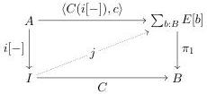

11:24

D. GRATZER, G.A. KAVVOS, A. NUYTS, AND L. BIRKEDAL

Vol. 17:3

The lower morphism $\prod$ models the formation rule: the premises of the rule constitute a pair of the form (5.4). We may thus combine them into an arrow $\mathbf{y}(\Gamma) \Rightarrow \mathbf{P}_{[\mathbf{\Omega}_{\mu}]^{*}\tau_{n}}(\mathcal{T}_{n})$, and then postcompose $\prod$ to obtain a morphism $\mathbf{y}(\Gamma) \Rightarrow \mathcal{T}_{m}$, i.e. a type at mode $m$ in context $\Gamma \operatorname{ctx} @ m$. In a similar fashion, the top morphism $\mathbf{lam}$ models the introduction rule. The $\beta$ and $\eta$ laws then follow from the pullback property of the square: see [Awo18].

5.2.2. Modal Structure. The interpretation of the modal types is a bit more involved. Intuitively, the reason is that $\langle \mu \mid A \rangle$ behaves like a positive type former, i.e. one with a 'let-style' pattern-matching eliminator, and no $\eta$-rule. These features render its behaviour closer to that of intensional identity types.

First, for each $\mu : \operatorname{Hom}_{\mathcal{M}}(n, m)$ the formation and introduction rules for $\langle \mu \mid - \rangle$ are given by a commuting square

$$\begin{array}{c} [\mathbf{\Omega}_{\mu}]^{*}\widetilde{\mathcal{T}}_{n} \xrightarrow{\mathbf{mod}_{\mu}} \widetilde{\mathcal{T}}_{m} \\ [\mathbf{\Omega}_{\mu}]^{*}\tau_{n} \Bigg\downarrow \quad \quad \quad \quad \quad \quad \quad \quad \quad \quad \quad \quad \quad \quad \quad \quad \quad \quad \quad \quad \quad \quad \quad \quad \quad \quad \quad \quad \quad \quad \quad \quad \quad \quad \quad \quad \quad \quad \quad \quad \quad \quad \quad \quad \quad \quad \quad \quad \quad \quad \text{ } \\ [\mathbf{\Omega}_{\mu}]^{*}\mathcal{T}_{n} \xrightarrow{\mathbf{Mod}_{\mu}} \mathcal{T}_{m} \end{array} \tag{5.5}$$

By Yoneda, every type $\Gamma \mathbf{\Omega}_{\mu} \vdash A \operatorname{type}_{1} @ n$ can be seen as a morphism $\mathbf{y}(\Gamma) \Rightarrow [\mathbf{\Omega}_{\mu}]^{*}\tau_{n}$. Postcomposition with $\mathbf{Mod}_{\mu}$ gives a morphism $\mathbf{y}(\Gamma) \Rightarrow \mathcal{T}_{m}$, which constitutes the interpretation of the type $\Gamma \vdash \langle \mu \mid A \rangle \operatorname{type}_{1} @ m$. $\mathbf{mod}_{\mu}$ interprets the introduction rule in a similar fashion. Nevertheless, asking that this square be a pullback is stronger than the elimination rule. In Section 7 we shall see that states that $\mathbf{Mod}_{\mu}$ is a dependent right adjoint.

Instead, we will model our elimination rule by a lifting structure. We phrase this definition in the internal language of the presheaf topos $\mathbf{PSh}(\mathcal{C}[m])$, i.e. extensional type theory.⁵ This has a serious technical advantage: as the definition is given in an empty context, the given lifts are automatically natural.

Definition 5.5 (Left lifting structure). Given $\vdash A, I, B$ type, a family $b : B \vdash E[b]$ type and a section $a : A \vdash i[a] : I$, we define the type $\vdash i[-] \pitchfork E[-]$ type of left lifting structures for $i$ with respect to $E$ to be

$$i[-] \pitchfork E[-] \triangleq \prod_{C:I \to B} \prod_{c:\prod_{a:A} E[C(i[a])]} \left\{ j : \prod_{p:I} E[C(p)] \mid \forall a : A. j(i[a]) = c(a) \right\}$$

Informally, left lifting structures provide diagonal fillers for the diagram

Intuitively, $C : I \to B$ is the motive of an elimination: we would like to prove $E[C(p)]$ for all $p : I$. At the same time, $c : \prod_{a:A} E[C(i[a])]$ is a given section that specifies the desired computational behaviour of this elimination at the 'special case' $A$. The left lifting structure

⁵This is derived from unpublished work by Jon Sterling, Daniel Gratzer, Carlo Angiuli, and Lars Birkedal.