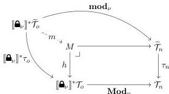
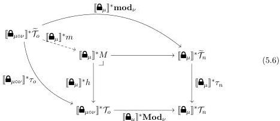

11:26

D. GRATZER, G.A. KAVVOS, A. NUYTS, AND L. BIRKEDAL

Vol. 17:3

First, given $\nu : \operatorname{Hom}_{\mathcal{M}}(o, n)$ we construct the following pullback:

The outer commuting square is that given by the formation and introduction for $\langle \nu \mid - \rangle$, as in (5.5). Intuitively, $M$ is a 'generic $\nu$-modal terms object' that consists of terms $\Gamma \vdash M : \langle \nu \mid A \rangle @ n$, where $\Gamma \cdot \widehat{\bullet}_{\nu} \vdash A \text{ type}_1 @ o$. We know that $[\widehat{\bullet}_{\mu}]^*$ has a left adjoint, so it preserves pullbacks. Applying it to this diagram yields

We have also used the fact that $(-)^*$ is functorial to contract the two locks into one. Moreover, we get that the unique mediating morphism is indeed $[\widehat{\bullet}_{\mu}]^* m$.

From this point onwards we will also work in the slice $\mathbf{PSh}(\mathcal{C}[m])/Z$, where $Z \triangleq [\widehat{\bullet}_{\mu \circ \nu}]^* \mathcal{T}_o$. In order to model the elimination rule we will ask for a left lifting structure *in the slice category*, of type

$$\vdash \mathbf{open}_{\nu}^\mu : [\widehat{\bullet}_{\mu}]^* m \pitchfork Z^*(\tau_m) \quad (5.7)$$

where both of these are considered as morphisms in the slice $\mathbf{PSh}(\mathcal{C}[m])/Z$, respectively of type

$$[\widehat{\bullet}_{\mu}]^* m : [\widehat{\bullet}_{\mu \circ \nu}]^* \tau_o \rightarrow [\widehat{\bullet}_{\mu}]^* h$$

$$Z^*(\tau_m) : Z^*(\widetilde{\mathcal{T}}_m) \rightarrow Z^*(\mathcal{T}_m)$$

Following [Awo18] we may calculate that this models the rule. We suppose its premises, and construct the diagram of Figure 10. The right (both top and bottom) part of the diagram is just (5.6). The bottom composite is easily seen to correspond to the application of the introduction rule of $\langle \nu \mid - \rangle$ to the type $\Gamma \cdot \widehat{\bullet}_{\mu} \cdot \widehat{\bullet}_{\nu} \vdash A \text{ type}_1 @ o$, and hence to the type $\Gamma \cdot \widehat{\bullet}_{\mu} \vdash \langle \nu \mid A \rangle \text{ type}_1 @ n$. The outer bottom square is the natural model pullback square that defines the object $\Gamma \cdot (\mu \mid \langle \nu \mid A \rangle)$, and we thus get a mediating morphism to $[\widehat{\bullet}_{\mu}]^* M$, and that the bottom-left square is also a pullback. The left (both top and bottom) part of