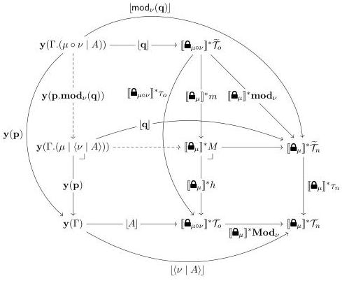

Vol. 17:3

MULTIMODAL DEPENDENT TYPE THEORY

11:27

Figure 10: Modelling the elimination rule

the diagram is the natural model pullback square that defines the object $\Gamma.(\mu \circ \nu \mid A)$. We hence get a mediating morphism $\mathbf{p}.\mathbf{mod}_{\nu}(\mathbf{q}): \Gamma.(\mu \circ \nu \mid A) \to \Gamma.(\mu \mid \langle \nu \mid A \rangle)$. Finally, for the same reasons as the bottom composite, the top composite is easily seen to correspond to the term $\mathbf{mod}_{\nu}(\mathbf{q})$.

We write $\sum_{Z}: \mathbf{PSh}(\mathcal{C}[m])/Z \to \mathbf{PSh}(\mathcal{C}[m])$ for the usual domain projection functor, so that $\sum_{Z} \dashv Z^{*}$. Now, using the usual approach to slice categories—where the cartesian product $\times_{Z}$ is the pullback—we see from the diagram that

$$\begin{array}{l} \sum_{Z}(\lfloor A \rfloor \times_{Z} [\mathbf{\Theta}_{\mu \circ \nu}]^{*} \widetilde{\mathcal{T}}_{o}) \cong \mathbf{y}(\Gamma.(\mu \circ \nu \mid A)) \\ \sum_{Z}(\lfloor A \rfloor \times_{Z} [\mathbf{\Theta}_{\mu}]^{*} h) \cong \mathbf{y}(\Gamma.(\mu \mid \langle \nu \mid A \rangle)) \end{array} \tag{5.8}$$

$$\sum_{Z}(\mathrm{id}_{\lfloor A \rfloor} \times_{Z} [\mathbf{\Theta}_{\mu}]^{*} m) \cong \mathbf{y}(\mathbf{p}.\mathbf{mod}_{\nu}(\mathbf{q}))$$