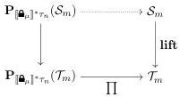
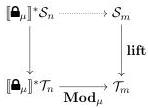
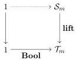

Vol. 17:3

MULTIMODAL DEPENDENT TYPE THEORY

11:29

5.2.4. Universe. The universe itself is given by a presheaf $\mathcal{S}_m$ at each mode $m$. The Coquand-style isomorphism is implemented by a natural transformation $\mathbf{Uni}: 1 \Rightarrow \tau_m$, which stands for the universe type at mode $m$, as well as a natural isomorphism

$$\tau_m^{-1}(\mathbf{Uni}) \cong \mathcal{S}_m$$

As the pullback of $\tau_m$ along $\mathbf{Uni}$ is $\mathbf{y}(1.\mathbf{Uni})$, this exactly postulates an isomorphism between terms of the universe and small types. The coercion from small to large type is interpreted by a natural transformation $\mathbf{lift}: \mathcal{S}_m \Rightarrow \mathcal{T}_m$ that maps each small type to its associated large type. Moreover, we ask that the formation rules factor through small types: we require a mediating morphism in each of the following diagrams:⁶

These factorisations ensure that type formation is closed under small types, and commutation ensures that the coercions commute with the type formers definitionally.

5.2.5. The full definition. We have shown how to interpret each rule of MTT through natural models. In fact, every step of our working is reversible: each contraption we have introduced precisely corresponds to the portion of the generalized algebraic theory it was used to interpret. In summary, we can make the following definition.

Definition 5.6. A model of MTT over $\mathcal{M}$ consists of

- a modal context structure for $\mathcal{M}$ (as in Definition 5.1), and a
- a modal natural model on that context structure (as in Definition 5.4)

such that the modal natural model supports

- dependent product types
- dependent sum types (at each mode)
- intensional identity types (at each mode)
- modal types
- a boolean type (at each mode), and
- a universe of small types.

5.3. Morphisms of Models. The generalized algebraic theory (GAT) of MTT also induces a notion of morphism between models. Traditionally neglected, morphisms are of paramount importance when one produces semantic proofs of metatheoretic properties, such as canonicity, a proof of which we will present in Section 6.

The last decade has seen much use of relatively weak morphisms of CwFs, i.e. morphisms which preserve structures only up to isomorphism: see e.g. [CD14, BCM⁺20]. However, our proof of canonicity will require the strictest notion of CwF morphism, i.e. a GAT homomorphism. Such morphisms preserve all structure on-the-nose, including context

⁶There are also similar diagrams for $\Sigma$ and intensional identity types.