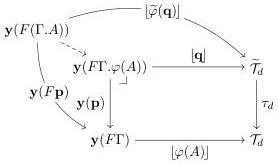

11:30

D. GRATZER, G.A. KAVVOS, A. NUYTS, AND L. BIRKEDAL

Vol. 17:3

extension, and were introduced alongside CwFs by [Dyb96]. As we are using natural models, we will use an adaptation due to [New18, §2.3]. We believe that one may construct a biequivalence or biadjunction between a category based on strict morphisms and one based on weaker ones, as done by e.g. [Uem19], but we will leave that to future work.

Definition 5.7 (Strict morphism of natural models). A morphism of natural models \((\mathcal{C},\widetilde{\mathcal{T}}_c\xrightarrow{\tau_c}\mathcal{T}_c)\to (\mathcal{D},\widetilde{\mathcal{T}}_d\xrightarrow{\tau_d}\mathcal{T}_d)\) comprises a functor \(F:\mathcal{C}\to \mathcal{D}\) and a commuting diagram

\[
\begin{array}{c} \widetilde {\mathcal {T}} _ {c} \xrightarrow {\widetilde {\varphi}} F ^ {*} \widetilde {\mathcal {T}} _ {d} \\ \tau_ {c} \Bigg \downarrow \quad \quad \quad \quad \quad \quad \quad \quad \quad \quad \quad \quad \quad \quad \quad \quad \quad \quad \quad \quad \quad \quad \quad \quad \quad \quad \quad \quad \quad \quad \quad \quad \quad \quad \quad \quad \quad \quad \quad \quad \quad \quad \quad \quad \quad \quad \quad \quad \quad \quad \text { (5.10) } \\ \mathcal {T} _ {c} \xrightarrow {\varphi} F ^ {*} \mathcal {T} _ {d} \end{array}
\]

such that \( F(\mathbf{1}) = \mathbf{1} \) and the canonical morphism \( F(\Gamma, A) \to F(\Gamma). \varphi(A) \) is an identity.

The type \(\varphi(A)\) in the last line is defined as follows. Given \(\lfloor A\rfloor : \mathbf{y}(\Gamma) \Rightarrow \mathcal{T}_c\) we let

\[
k \triangleq \mathbf {y} (\Gamma) \xrightarrow {\lfloor A \rfloor} \mathcal {T} _ {c} \xrightarrow {\varphi} F ^ {*} \widetilde {\mathcal {T}} _ {d}
\]

By Yoneda this induces a natural isomorphism

\[
\operatorname{Hom} _ {\mathbf {P S h} (\mathcal {C})} (\mathbf {y} (\Gamma), F ^ {*} \mathcal {T} _ {d}) \cong F ^ {*} \mathcal {T} _ {d} (\Gamma) = \mathcal {T} _ {d} (F (\Gamma)) \cong \operatorname{Hom} _ {\mathbf {P S h} (\mathcal {D})} (\mathbf {y} (F \Gamma), \mathcal {T} _ {d}) \tag {5.11}
\]

We define \(\lfloor \phi (A)\rfloor :\mathbf{y}(F\Gamma)\Rightarrow \mathcal{T}_d\) to be \(k\) transported under this isomorphism. Also, let

\[
\lfloor M \rfloor : \mathbf {y} (\Gamma) \Rightarrow \mathcal {T} _ {c} \quad \longmapsto \quad \lfloor \widetilde {\varphi} (M) \rfloor : \mathbf {y} (F (\Gamma)) \Rightarrow \mathcal {T} _ {d}
\]

which maps a term \(\Gamma \vdash M:A\) to a term \(F\Gamma \vdash \widetilde{\varphi}(M):\varphi (A)\) in a similar manner.

Returning to the last condition in the definition, we may now form the diagram

where the outer square is the diagram composed by pasting together the context extension diagram for \(\Gamma, A\) and (5.10), followed by transposing along the natural isomorphism (5.11). We then ask that the unique induced arrow be the identity.

We can lift these natural transformations to the formation data of the connectives (making special use of the final equality for the polynomial functors). For instance, we can define a morphism

\[
\mathbf {P} _ {\tau_ {c}} (\mathcal {T} _ {c}) \xrightarrow {(\varphi , \widetilde {\varphi})} \mathbf {P} _ {F ^ {*} \tau_ {d}} (F ^ {*} \mathcal {T} _ {d}) \triangleq \mathbf {P} _ {\tau_ {c}} (\mathcal {T} _ {c}) \to \mathbf {P} _ {F ^ {*} \mathcal {T} _ {d}} (\mathcal {T} _ {c}) \xrightarrow {\mathbf {P} _ {F ^ {*} \mathcal {T} _ {d}} (\varphi)} \mathbf {P} _ {F ^ {*} \tau_ {d}} (F ^ {*} \mathcal {T} _ {d})
\]

The first component comes from a natural transformation \(\mathbf{P}_{\tau_c}(-) \Rightarrow \mathbf{P}_{F^* \mathcal{T}_d}(-)\), which exists because (5.10) not only commutes, but is a pullback square. That is a nontrivial fact proven