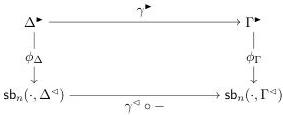
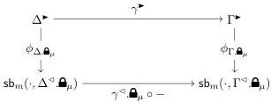
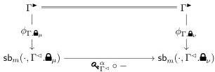

Vol. 17:3

MULTIMODAL DEPENDENT TYPE THEORY

11:33

taking the $\mathcal{C}[n]$ morphism

to the $\mathcal{C}[m]$ morphism:

where the function $\phi_{\Delta \bullet \bullet}$ is defined by

$$\phi_{\Delta \bullet \bullet}(x) \triangleq \phi_{\Delta}(x) \bullet \bullet : \cdot \to \Delta^{\triangle} \bullet \bullet$$

Notice that the equation $\cdot \bullet \bullet = \cdot$ is necessary to ensure that this definition is well-typed. The diagram commutes because locks act functorially on substitutions. It is also functorial in $\mu$, because $\Gamma \bullet \bullet = \Gamma \bullet \bullet_{\mu \circ \nu}$, and $\Gamma \bullet \bullet = \Gamma$.

We define a 2-cell $[\bullet \bullet] \Rightarrow [\bullet \bullet] \text{ for each } \alpha : \nu \Rightarrow \mu$. The component at $(\Gamma^{\blacktriangleright}, \Gamma^{\triangle}, \phi_{\Gamma})$ is

This diagram commutes because of (6.1), so it is a morphism in comma category. Naturality follows from the numerous equations pertaining to keys and their composition.

This completes the definition of a strict 2-functor $\mathcal{M}^{\text{coop}} \to \mathbf{Cat}_1$ as per Section 5.1. Next, we must define the modal natural model structure for each category of contexts.

**Remark 6.5.** For the rest of this section we will freely use type-theoretic notation, viewing the predicate $\Gamma^{\blacktriangleright} \to \mathsf{sb}_m(\cdot, \Gamma^{\triangle})$ as a family fibred over $\mathsf{sb}_m(\cdot, \Gamma^{\triangle})$, i.e. a map $\mathsf{sb}_m(\cdot, \Gamma^{\triangle}) \to \mathcal{V}$.

We will follow the convention that symbols annotated with $(-)^{\blacktriangleright}$ correspond to proof-relevant constructions—i.e. members of the predicate, or maps between predicates—whereas symbols annotated with $(-)^{\triangle}$ correspond to pieces of syntax (e.g. terms, contexts, substitutions). In particular, $\gamma^{\blacktriangleright}$ will not necessarily refer to a fibred map between proof-relevant predicates, but also to a generalized element of $\Gamma^{\blacktriangleright}$.

In other words, when $\gamma^{\blacktriangleright} \in \Gamma^{\blacktriangleright}$ and $\phi_{\Gamma}(\gamma^{\blacktriangleright}) = \gamma^{\triangle} : \cdot \to \Gamma^{\triangle}$, we will abusively write $\gamma^{\blacktriangleright} : \Gamma^{\blacktriangleright}(\gamma^{\triangle})$. That is, we will view $\gamma^{\blacktriangleright}$ as living in the fibre of $\phi_{\Gamma}$ over $\gamma^{\triangle}$. This amounts to