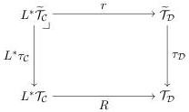

Vol. 17:3

MULTIMODAL DEPENDENT TYPE THEORY

11:35

6.2. Deriving Canonicity. With the gluing model constructed, the rest of the proof is surprisingly easy and boils down to one fact, which is immediate by inspection:

Theorem 6.6. The 2-natural transformation $\pi : \mathcal{C}[-] \Rightarrow \mathbb{S}[-]$ from the glued model to the syntactic model which forgets the predicates extends to a morphism of models.

Thus, assuming $\cdot \mathbf{\Theta}_n = \cdot \operatorname{ctx} @ m$ it follows that

Corollary 6.7. For any closed term $\vdash M : A @ m$, there is a witness for $[[A]]^\blacktriangleright (M)$.

Proof. By Theorem 6.6 and initiality we must have $\pi([[M]]) = M$, and so $[[M]]^\blacktriangleright$ is a witness.

Theorem 6.8 (Closed Term Canonicity). If $\cdot \vdash M : A @ m$ is a closed term, then

- If $A = \mathbb{B}$ then $\cdot \vdash M = \operatorname{tt} : \mathbb{B} @ m$ or $\cdot \vdash M = \operatorname{ff} : \mathbb{B} @ m$.
- If $A = \operatorname{Id}_{A_0}(N_0, N_1)$ then $\cdot \vdash N_0 = N_1 : A_0 @ m$ and $\cdot \vdash M = \operatorname{refl}(N_0) : \operatorname{Id}_{A_0}(N_0, N_1) @ m$.
- If $A = \langle \nu \mid A_0 \rangle$ then there is an $\cdot \vdash N : A_0 @ n$ such that $\cdot \vdash M = \operatorname{mod}_\nu(N) : \langle \nu \mid A_0 \rangle @ m$.

Proof. Immediate by Corollary 6.7 and the definition of the semantic predicates at $\mathbb{B}$, $\operatorname{Id}_{A_0}(N_0, N_1)$, and $\langle \nu \mid A_0 \rangle$ respectively.

# 7. DEPENDENT RIGHT ADJOINTS

Over the past couple of years the structure of a dependent right adjoint (DRA) has arisen as a natural notion of dependent modality in Martin-Löf type theory. In this section we will study the relationship between MTT modalities and DRAs in detail. After reviewing the definition of a DRA, we will prove that a suitably functorial collection of DRAs induces a model of MTT. As mentioned before, this implies that MTT modalities are weaker than DRAs. Following that, we will investigate sufficient conditions for extending an ordinary right adjoint to a DRA.

7.1. Dependent right adjoints in natural models. A dependent right adjoint$^7$ is an adaptation of the notion of adjunction to the dependent setting: instead of acting on objects of the context category, the 'right adjoint' only acts on types and terms.

Given a pair of natural models $(\mathcal{D}, \tau_{\mathcal{D}})$ and $(\mathcal{C}, \tau_{\mathcal{C}})$, a DRA from the second to the first comprises a functor $L : \mathcal{D} \to \mathcal{C}$ between the underlying context categories, as well as a pullback diagram of the following shape in $\mathbf{PSh}(\mathcal{D})$:

$R$ is the action on types, and $r$ is the action on terms. Note that, while the 'left adjoint' $L$ acts on context categories, the 'right adjoint' $(R, r)$ only acts on types and terms. The fact

$^7$DRAs were introduced by $[\mathrm{BCM}^+ 20]$ as endomodalities, but we generalise them to multiple modes.