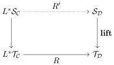
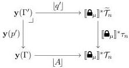
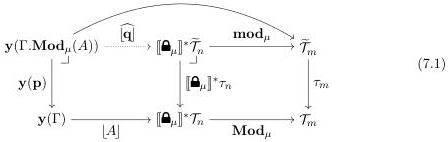

11:36

D. GRATZER, G.A. KAVVOS, A. NUYTS, AND L. BIRKEDAL

Vol. 17:3

the square is a pullback amounts to requiring a multimode generalization of the definition given by  \( [BCM^{+}20] \) . Intuitively, for each term  \( \Gamma\vdash M:R(A) \) , the pullback square gives a unique term  \( L(\Gamma)\vdash N:A \)  such that  \( \Gamma\vdash M=r(N):R(A) \) . If we wish the modality to preserve the size of types, we must also require a  \( R' \)  such that

7.2. DRAs as Models of MTT. We will now show that DRAs can be used to construct models of MTT. As a consequence, MTT modalities are slightly weaker than DRAs.

Theorem 7.1. Suppose that we have

- for each \(m \in \mathcal{M}\) a natural model \((\mathcal{C}[m], \widetilde{\mathcal{T}}_m \xrightarrow{\tau_m} \mathcal{T}_m)_{m \in \mathcal{M}}\) of MLTT;
- for each modality \(\mu : \mathrm{Hom}_{\mathcal{M}}(m,n)\) a size-preserving DRA (\([\widehat{\mathbf{B}}_{\mu}], \mathbf{Mod}_{\mu}, \mathbf{mod}_{\mu})\) from \((\mathcal{C}[m], \widetilde{\mathcal{T}}_m \xrightarrow{\tau_m} \mathcal{T}_m)\) to \((\mathcal{C}[n], \widetilde{\mathcal{T}}_n \xrightarrow{\tau_n} \mathcal{T}_n)\);
- for each 2-cell \(\alpha : \mu \Rightarrow \nu\) in \(\mathcal{M}\) a natural transformation \([\widehat{\mathbf{Q}}^{\alpha}] : [\widehat{\mathbf{Q}}_{\nu}] \Rightarrow [\widehat{\mathbf{Q}}_{\mu}]\).

Moreover, suppose that the above choices are 2-functorial. Then this data can be assembled into a model of MTT, where each mode m is interpreted by  \( (\mathcal{C}[m], \widetilde{\mathcal{T}}_{m} \xrightarrow{\tau_{m}} \mathcal{T}_{m}) \) .

Proof. Define a 2-functor \(\mathcal{M}^{\mathrm{coop}}\to \mathbf{Cat}\) by \(m\mapsto \mathcal{C}[m]\), \(\mu \mapsto [\widehat{\mathbf{B}}_{\mu}]\), and \(\alpha \mapsto [\widehat{\mathbf{Q}}^{\alpha}]\). We must show how to define context extension, and how to interpret the connectives. As before, we only show the modal cases, the others being straightforward.

Modal Context Extension: For each type  \( \mathbf{y}(\Gamma) \xrightarrow{\lfloor A \rfloor} [\widehat{\mathbf{B}}_{\mu}]^{*} \mathcal{T}_{n} \)  we need a pullback

Write  \( \lfloor\mathbf{Mod}_{\mu}(A)\rfloor\triangleq\mathbf{Mod}_{\mu}\circ\lfloor A\rfloor \) .  \( \tau_{m} \)  is a natural model, so form the pullback square for  \( \Gamma'\triangleq\Gamma.\mathbf{Mod}_{\mu}(A) \) . Pasting this with the DRA pullback for  \( Mod_{\mu} \)  forms

