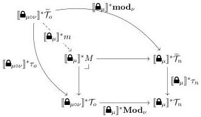

Vol. 17:3

MULTIMODAL DEPENDENT TYPE THEORY

11:37

As the outer square commutes, we can fill in the dotted arrow. By the pullback lemma, the square on the left is a pullback too. Letting $\Gamma.(\mu \mid A) \triangleq \Gamma.\mathbf{Mod}_{\mu}(A)$ proves that $(\tau_m)_{m \in \mathcal{M}}$ is a modal natural model.

**Modal Types:** This is the heart of the proof. First, we need a commuting square

$$\begin{array}{c} \llbracket \widehat{\boldsymbol{\Omega}}_{\mu} \rrbracket^* \widetilde{\mathcal{T}}_n \xrightarrow{\mathbf{mod}_{\mu}} \widetilde{\mathcal{T}}_m \\ \Big\downarrow \quad \quad \quad \quad \quad \quad \quad \quad \quad \quad \quad \quad \quad \quad \quad \quad \quad \quad \quad \quad \quad \quad \quad \quad \quad \quad \quad \quad \quad \quad \quad \quad \quad \quad \quad \quad \quad \quad \quad \quad \quad \quad \quad \quad \quad \quad \quad \quad \quad \quad \text{ } \\ \llbracket \widehat{\boldsymbol{\Omega}}_{\mu} \rrbracket^* \mathcal{T}_n \xrightarrow{\mathbf{Mod}_{\mu}} \mathcal{T}_m \end{array} \tag{7.2}$$

Such a square is given as part of a DRA by definition, and is in fact a pullback!

To model the elimination rule, recall the definition of the object $M$ used in Section 5.2.2:

As $\llbracket \widehat{\boldsymbol{\Omega}}_{\mu} \rrbracket^*$ preserves pullbacks, the outer square is a pullback too. Hence $\llbracket \widehat{\boldsymbol{\Omega}}_{\mu} \rrbracket^* m$ must be an isomorphism. The elimination rule requires a left-lifting structure:

$$\vdash \mathbf{open}_{\nu}^{\mu} : (\llbracket \widehat{\boldsymbol{\Omega}}_{\mu} \rrbracket^* m) \pitchfork (\llbracket \widehat{\boldsymbol{\Omega}}_{\mu \circ \nu} \rrbracket^* \mathcal{T}_o)^* (\tau_m[-])$$

Using the inverse of $\llbracket \widehat{\boldsymbol{\Omega}}_{\mu} \rrbracket^* m$ we can construct this by

$$\mathbf{open}_{\nu}^{\mu} \triangleq \lambda C. \ \lambda c. \ c \circ \llbracket \widehat{\boldsymbol{\Omega}}_{\mu} \rrbracket^* (m^{-1})$$

### $\Pi$ Structure:

Equipping each $\widetilde{\mathcal{T}}_m \xrightarrow{\tau_m} \mathcal{T}_m$ with a modal $\Pi$ structure is relatively straightforward to do in the internal language; intuitively, the reason is the isomorphism

$$(\llbracket \widehat{\boldsymbol{\Omega}}_{\mu} \rrbracket^* \tau_n)^{-1}(A) \cong \tau_m^{-1}(\mathbf{Mod}_{\mu}A)$$

which is derived from the fact $\Gamma.(\mu \mid A) \triangleq \Gamma.\mathbf{Mod}_{\mu}A$ (where the first dot is the defined context extension, and the second dot is given by the natural model). However, we