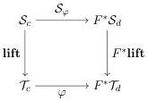
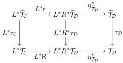

Vol. 17:3

MULTIMODAL DEPENDENT TYPE THEORY

11:39

such that $F(1) = 1$ and the canonical morphism $F(\Gamma.A) \to F\Gamma.\varphi(A)$ is an isomorphism. We say that this morphism *preserves size* whenever there is a commuting square

This kind of morphism can also be found in the thesis of [New18, §§2.3.9]. We are interested in it because it captures exactly the necessary good behaviour which is required to extend a right adjoint to act on types and terms.

**Lemma 7.4.** *Suppose that $(\mathcal{C}, \tau_{\mathcal{C}})$ and $(\mathcal{D}, \tau_{\mathcal{D}})$ are natural models, and that $L \dashv R$ is an adjunction between $\mathcal{C}$ and $\mathcal{D}$. If the right adjoint $R : \mathcal{C} \to \mathcal{D}$ extends to a weak morphism of natural models then it gives rise to a dependent right adjoint. Moreover, the resulting DRA is size-preserving whenever $R$ is.*

*Proof.* We first fix some notation: we write $\eta : \mathsf{Id} \Rightarrow RL$ for the unit of the adjunction $L \dashv R$. Moreover, we assume a commuting square

$$\begin{array}{c} \widetilde{\mathcal{T}}_{\mathcal{C}} \xrightarrow{\mathsf{r}} R^*\widetilde{\mathcal{T}}_{\mathcal{D}} \\ \tau_{\mathcal{C}} \Bigg\downarrow \qquad \qquad \qquad \qquad \qquad \qquad \qquad \qquad \qquad \qquad \qquad \qquad \qquad \qquad \qquad \qquad \qquad \qquad \qquad \qquad \qquad \qquad \qquad \qquad \qquad \qquad \qquad \qquad \qquad \qquad \qquad \qquad \qquad \qquad \\ \mathcal{T}_{\mathcal{C}} \xrightarrow{\mathsf{R}} R^*\mathcal{T}_{\mathcal{D}} \end{array} \tag{7.3}$$

that witnesses the weak natural model morphism structure of $R$, and write

$$\nu_{\Gamma,A} : R\Gamma.\mathsf{R}(A) \xrightarrow{\cong} R(\Gamma.A)$$

for the canonical isomorphism corresponding to $[A] : \mathbf{y}(\Gamma) \Rightarrow \mathcal{T}_{\mathcal{C}}$.

We construct the DRA by first applying the weak morphism $\mathsf{R}$ to a dependent type over a context of the form $L(\Delta)$, and then pulling that back along the unit of the adjunction. Diagrammatically, we define the square

The left part is the image of (7.3) under the $L^*$ functor, and the right part is a naturality square for the natural transformation $\eta^* : L^*R^* = (RL)^* \Rightarrow \mathsf{Id}$ induced by the unit.

To show that this is a DRA we must show that this is a pullback, and it suffices to do so on the representables. Assume we have $[A] : \mathbf{y}(\Delta) \Rightarrow L^*\mathcal{T}_{\mathcal{C}}$ and a $[M] : \mathbf{y}(\Delta) \Rightarrow \widetilde{\mathcal{T}}_{\mathcal{D}}$ such